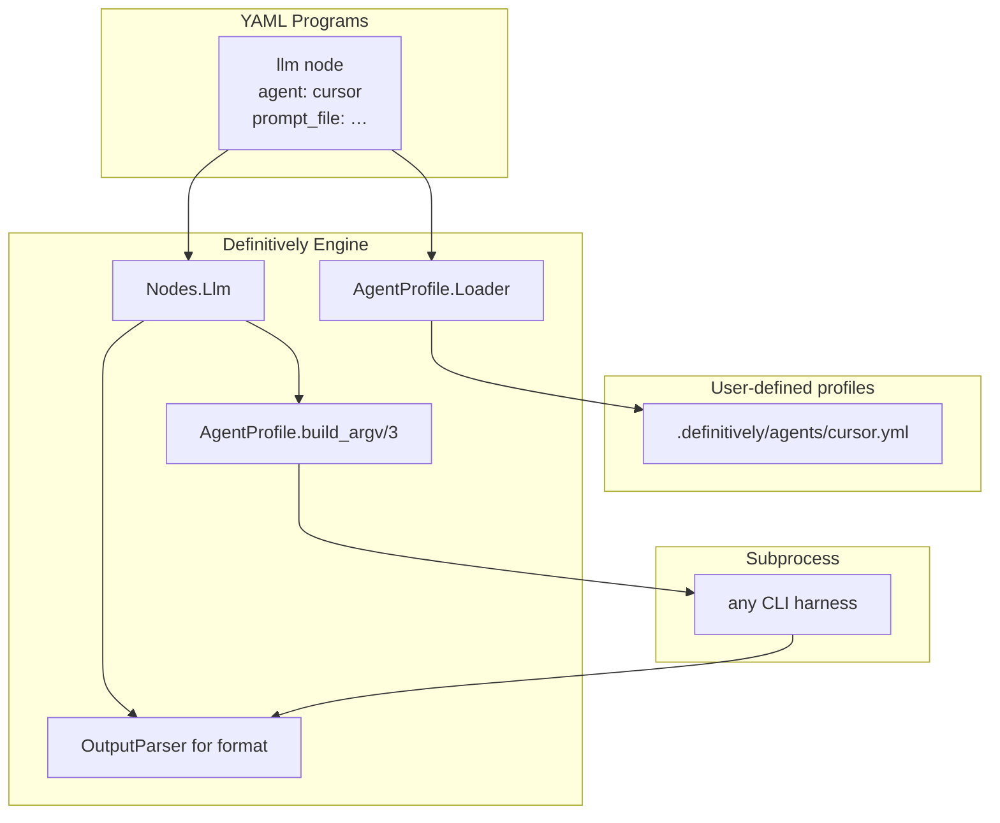
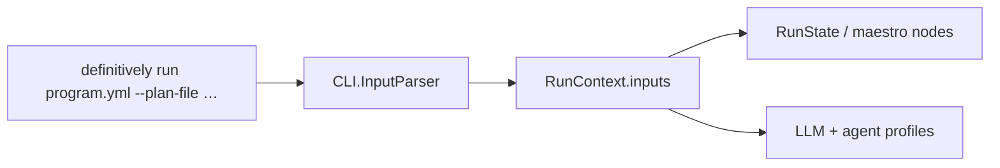

# Agent Profile Refactor (Harness-Agnostic LLM Nodes)

## Problem

Cursor is hard-coded at four layers today:

| Layer | Coupling |
|-------|----------|
| Programs | [`dev-quality-loop.yml`](.definitively/programs/dev-quality-loop.yml), [`plan-mission.yml`](.definitively/programs/plan-mission.yml) — 12-line `cursor-agent` argv anchor |
| Executor | [`llm.ex`](definitively/lib/definitively/nodes/llm.ex) — `resolve_executable("cursor-agent")`, `DEFINITIVELY_CURSOR_AGENT`, Nix default path |
| Output parsing | [`llm.ex`](definitively/lib/definitively/nodes/llm.ex) — `decode_llm_line` knows Cursor stream-json `{type: result, result: …}` |
| Docs/env | book, [`devenv.nix`](devenv.nix), [`env.example`](.definitively/env.example) |
| Run inputs | [`plan-mission.yml`](.definitively/programs/plan-mission.yml) requires `DEFINITIVELY_PLAN_FILE` env — no CLI flags |

Maestro/git/gh nodes already show the right pattern: **structured domain module + YAML config**, not vendor argv inlined in every program.

## Target architecture



**Principle:** Definitively ships the **profile schema and parser primitives** only.

## Program inputs (CLI flags, not env vars)

Today `plan-mission` reads the plan path from `DEFINITIVELY_PLAN_FILE` via [`RunState.init_plan/2`](definitively/lib/definitively/maestro/run_state.ex). That is awkward for a CLI tool — inputs should be ordinary arguments.

### Declarative inputs in program YAML

Programs declare named inputs under `program.inputs`:

```yaml
program:
  id: plan_mission
  version: 1
  initial: idle
  inputs:
    plan_file:
      type: path
      required: true
      description: Plan markdown (Cursor .plan.md or any planning doc)
    agent:
      type: string
      required: false
      default: cursor
      description: Agent profile id for LLM nodes
```

### CLI invocation

```bash
definitively run .definitively/programs/plan-mission.yml \
  --plan-file .cursor/plans/agent_profile_refactor_054927eb.plan.md

# optional override
definitively run .definitively/programs/plan-mission.yml \
  --plan-file path/to/plan.md \
  --agent claude
```

Flag names derive from input keys: `plan_file` → `--plan-file`. Short aliases optional later (`-f`).

`definitively run --help <program.yml>` prints declared inputs (parse program YAML without executing).

### Runtime flow



- [`RunContext`](definitively/lib/definitively/workflow/run_context.ex) gains `inputs: map()` populated at run start.
- [`RunState.init_plan/2`](definitively/lib/definitively/maestro/run_state.ex) reads `inputs["plan_file"]` first; **`DEFINITIVELY_PLAN_FILE` deprecated** (still accepted with warning for one release).
- Program YAML may reference inputs in node options via `{{input.plan_file}}` templating (v1: maestro `init_run` only; expand later).
- Unknown CLI flags → error with hint; missing required input → error before FSM starts.

### Modules to add

| Module | Role |
|--------|------|
| [`domain/program_input.ex`](definitively/lib/definitively/domain/program_input.ex) | Input struct: name, type, required, default |
| [`domain/program.ex`](definitively/lib/definitively/domain/program.ex) | Extend `Program` with `inputs: %{atom() => ProgramInput.t()}` |
| [`cli/input_parser.ex`](definitively/lib/definitively/cli/input_parser.ex) | Parse `--key value` / `--key=value` after program path |
| [`cli.ex`](definitively/lib/definitively/cli.ex) | `dispatch_run(program_path, rest)` → validate inputs → pass to `Coordinator.start/2` |

### plan-mission after change

No env var required:

```bash
definitively run "$PWD/.definitively/programs/plan-mission.yml" \
  --plan-file "$PWD/.cursor/plans/agent_profile_refactor_054927eb.plan.md"
```

Update [`.definitively/README.md`](.definitively/README.md) and [`.maestro/docs/DEFINITIVELY_INTEGRATION.md`](.maestro/docs/DEFINITIVELY_INTEGRATION.md) examples accordingly. Harness-specific argv (Cursor, Claude, OpenCode, Aider, custom wrappers) lives in user YAML under `.definitively/agents/`.

## Agent profile schema (v1)

New file per profile: `.definitively/agents/<id>.yml`

```yaml
agent:
  id: cursor                    # filename must match
  executable: cursor-agent      # or omit when using executable_env
  executable_env: DEFINITIVELY_AGENT_CURSOR_EXECUTABLE
  argv:
    - agent
    - --force
    - --model
    - "{{model}}"              # templated from node.model (default: auto)
    - --workspace
    - "."
    - --print
    - --output-format
    - stream-json
    - --
  prompt:
    mode: argv_after_delimiter  # argv_after_delimiter | flag | stdin
    flag: "-p"                  # when mode: flag
  output:
    format: stream_json         # stream_json | json | text
    extract: last_json_line     # last_json_line | whole_stdout
    envelope_path: result       # unwrap .result from {type: result, result: …}
    success_status: ok          # maps to signals + jq-friendly envelope
```

**Selection:**
- Per-node: `agent: cursor` on `kind: llm` nodes
- Default: `DEFINITIVELY_AGENT=cursor` when node omits `agent`
- Escape hatch: raw `command:` list still supported (mutually exclusive with `agent`)

**Executable resolution order:** `executable_env` → `executable` → error (no more magic `cursor-agent` rewrite in Elixir).

## Code changes

### 0. Program inputs + CLI flags

Extend [`Program`](definitively/lib/definitively/domain/program.ex) meta and [`Spec.Loader`](definitively/lib/definitively/spec/loader.ex) to parse `program.inputs`.

Refactor [`CLI.dispatch_run/1`](definitively/lib/definitively/cli.ex):
- `["run", program_path | rest]` → split flags from path via `InputParser`
- Validate required inputs before `Coordinator.start/2`
- Pass `inputs:` into `RunContext`

Update [`RunState`](definitively/lib/definitively/maestro/run_state.ex):
- `init_plan/2` prefers `RunContext.inputs["plan_file"]`
- Deprecate `DEFINITIVELY_PLAN_FILE` / `DEFINITIVELY_PLAN` (log warning)

Declare inputs on [`plan-mission.yml`](.definitively/programs/plan-mission.yml):

```yaml
program:
  inputs:
    plan_file:
      type: path
      required: true
```

Remove `plan_file` from maestro node `options` — sourced from run inputs instead.

### 1. New bounded context: `Definitively.AgentProfile`

| Module | Role |
|--------|------|
| [`domain/agent_profile.ex`](definitively/lib/definitively/domain/agent_profile.ex) | Struct: id, executable, argv, prompt, output |
| [`agent_profile/loader.ex`](definitively/lib/definitively/agent_profile/loader.ex) | Load `.definitively/agents/*.yml` |
| [`agent_profile/builder.ex`](definitively/lib/definitively/agent_profile/builder.ex) | `{executable, argv}` from profile + node + prompt |
| [`agent_profile/output_parser.ex`](definitively/lib/definitively/agent_profile/output_parser.ex) | Pluggable parsers: `stream_json`, `json`, `text` |
| [`spec/agent_profile_validator.ex`](definitively/lib/definitively/spec/agent_profile_validator.ex) | Schema validation |

Extend [`NodeDefinition`](definitively/lib/definitively/domain/node_definition.ex):

```elixir
@type t :: %__MODULE__{
  ...
  agent: atom() | nil,   # profile id
}
```

Update [`Spec.Loader`](definitively/lib/definitively/spec/loader.ex) + [`Spec.Validator`](definitively/lib/definitively/spec/validator.ex):
- Parse `agent:` on llm nodes
- Rule: llm node requires `prompt_file` and exactly one of `agent` or `command`

### 2. Refactor [`Nodes.Llm`](definitively/lib/definitively/nodes/llm.ex)

**Remove:** `@cursor_agent_bin`, `DEFINITIVELY_CURSOR_AGENT`, `resolve_executable/1` cursor special-case.

**Add:**
- Load profile registry once per run (keyed by workspace `.definitively/agents/`)
- `command_argv/2` branches:
  - `agent` set → `AgentProfile.Builder.build/3`
  - `command` set → existing `--` append behavior (unchanged)
  - neither → fall back to `DEFINITIVELY_LLM_COMMAND` stub (tests/dev)

Move stream-json line extraction from `decode_llm_line/1` into `OutputParser` so profiles declare format, not harness name.

### 3. Migrate repo programs

Replace `command: &cursor_agent` in:
- [`.definitively/programs/dev-quality-loop.yml`](.definitively/programs/dev-quality-loop.yml)
- [`.definitively/programs/plan-mission.yml`](.definitively/programs/plan-mission.yml)

With:

```yaml
llm_fix_lint:
  kind: llm
  agent: cursor        # or omit + DEFINITIVELY_AGENT
  model: auto
  prompt_file: .definitively/prompts/fix-lint.md
  ...
```

Add **user-authored** profile for this repo (committed as dogfood, not a definitively built-in):
- [`.definitively/agents/cursor.yml`](.definitively/agents/cursor.yml) — current cursor-agent argv moved here

Optional second example (documentation only, not wired into programs):
- `.definitively/agents/claude.yml.example`

### 4. Init + templates

Update [`Definitively.Init`](definitively/lib/definitively/init.ex) to copy:
- `priv/templates/definitively/agents/README.md` — schema + authoring guide
- `priv/templates/definitively/agents/example.yml` — minimal stub profile

Do **not** ship harness-specific profiles in `priv/` (per your choice).

Add [`priv/templates/definitively/nodes/llm.yml`](definitively/priv/templates/definitively/nodes/llm.yml) fragment showing `agent:` usage.

### 5. Environment + devenv

Replace in [`devenv.nix`](devenv.nix):

```bash
# remove
export DEFINITIVELY_CURSOR_AGENT=...

# add
export DEFINITIVELY_AGENT=cursor
export DEFINITIVELY_AGENT_CURSOR_EXECUTABLE=/run/current-system/sw/bin/cursor-agent
```

Update [`.definitively/env.example`](.definitively/env.example) and priv template accordingly.

Keep `DEFINITIVELY_LLM_COMMAND` for test stub / CI without an agent installed.

### 6. Documentation

| Doc | Change |
|-----|--------|
| [`book/src/authoring/llm-nodes.md`](book/src/authoring/llm-nodes.md) | Agent profiles as primary path; `command:` as advanced |
| New `book/src/authoring/agent-profiles.md` | Schema, prompt modes, output formats, examples |
| New `book/src/authoring/program-inputs.md` | Declaring inputs, CLI flags, examples |
| [`book/src/patterns/dev-quality-loop.md`](book/src/patterns/dev-quality-loop.md) | Replace cursor-agent anchor section |
| [`book/src/install/index.md`](book/src/install/index.md) | "Agent CLI (profile-defined)" instead of cursor-agent row |
| [`.definitively/README.md`](.definitively/README.md) | How to author + select profiles |
| [`.maestro/docs/DEFINITIVELY_INTEGRATION.md`](.maestro/docs/DEFINITIVELY_INTEGRATION.md) | Remove cursor-agent from subprocess layer diagram |

Prompts ([`.definitively/prompts/*.md`](.definitively/prompts/)) stay harness-agnostic — they already ask for `{"status":"ok","signals":{"fix_complete":true}}`.

### 7. Tests

| Test file | Coverage |
|-----------|----------|
| `cli/input_parser_test.exs` | Flag parsing, required inputs, type coercion (path expand) |
| `spec/loader_inputs_test.exs` | Program inputs schema validation |
| `agent_profile/loader_test.exs` | Valid/invalid profiles |
| `agent_profile/builder_test.exs` | argv templating, prompt modes |
| `agent_profile/output_parser_test.exs` | stream_json line extraction, json stdout, text fallback |
| `nodes/llm_test.exs` | Profile-driven execute; remove cursor-specific test |
| `spec/loader_test.exs` | llm node with `agent:` field; reject agent+command |
| Update fixtures | `dev_quality_loop.yml` test fixture uses profile or stub |

### 8. Version + migration note

Bump [`definitively/mix.exs`](definitively/mix.exs) to **0.4.0** (breaking: removed `DEFINITIVELY_CURSOR_AGENT`, programs must define profiles).

Add short **CHANGELOG** entry:
- `DEFINITIVELY_PLAN_FILE` deprecated → use `definitively run program.yml --plan-file path`
- `DEFINITIVELY_CURSOR_AGENT` removed → use agent profile + `DEFINITIVELY_AGENT_*_EXECUTABLE`
- LLM nodes prefer `agent:` over inlined `command:`

## Out of scope (later)

- Auto-detect installed harnesses
- Maestro-specific agent profile (maestro nodes already cover harness lifecycle)
- Per-state agent override in FSM (single `DEFINITIVELY_AGENT` is enough for v1)
- OpenCode profile until user authors one (profile-only model)
- Positional args (flags only in v1; `-- plan.md` later if needed)

## Rollout order

1. **Program inputs** — schema, CLI parser, RunContext, plan-mission `--plan-file`
2. AgentProfile domain + loader + validator
3. Llm executor refactor + tests with stub profile
4. Migrate repo programs + add `.definitively/agents/cursor.yml`
5. Remove cursor hardcoding + deprecated plan env vars
6. Docs + book chapter (inputs + agent profiles) + version bump

## Success criteria

- `dev-quality-loop.yml` and `plan-mission.yml` contain **zero** `cursor-agent` strings
- Switching harness = swap `DEFINITIVELY_AGENT` + add/edit profile YAML (no Elixir change)
- All existing definitively tests pass; new profile tests cover parser/builder
- `definitively run .definitively/programs/plan-mission.yml --plan-file .cursor/plans/foo.plan.md` works with no `DEFINITIVELY_PLAN_FILE`
- `mix definitively run .definitively/programs/dev-quality-loop.yml` works with repo's cursor profile + devenv env
