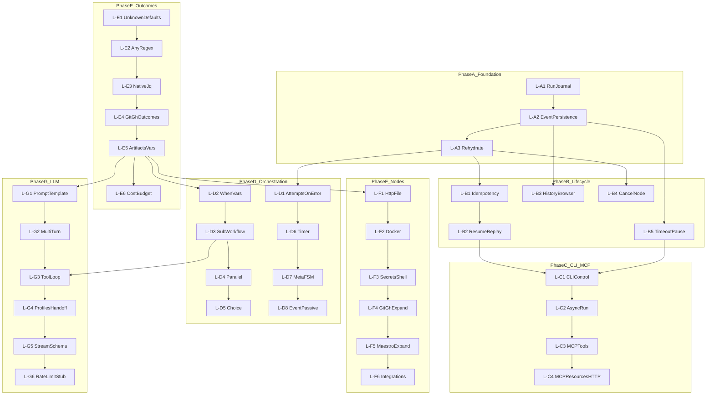
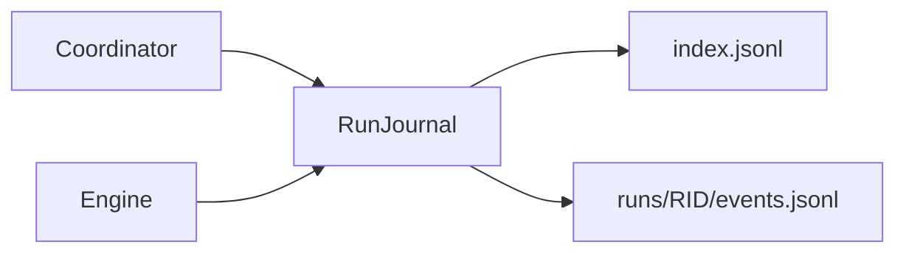
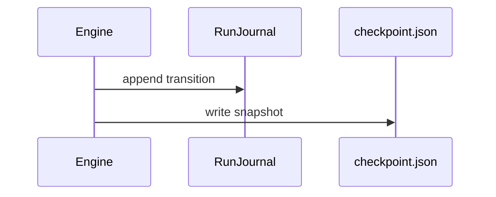
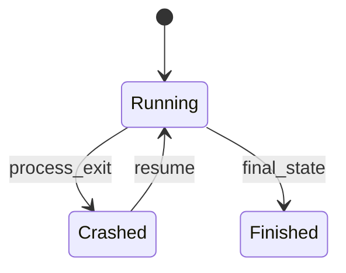
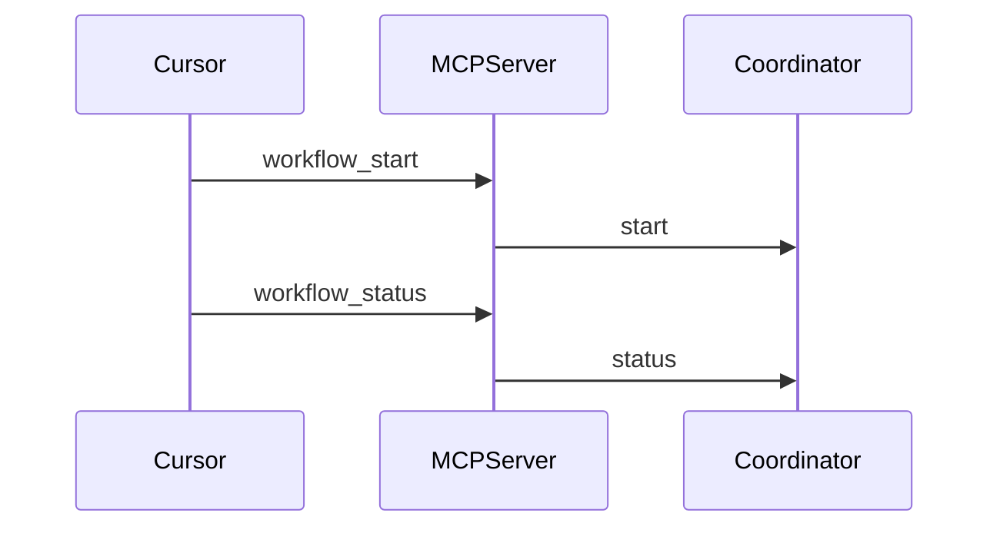
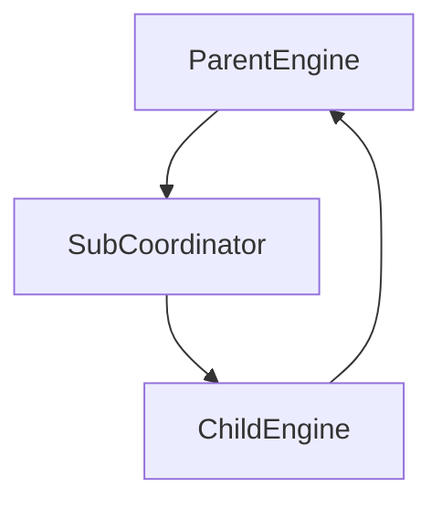

# Definitively Categories 1–6 — Hierarchical Implementation Plan

## Phase 0 — Reconnaissance

### Scope restatement

Implement **categories 1–6** from the competitive feature analysis as shippable product behavior in [`definitively/`](definitively/) (v0.4.0 today), with **JSONL-only persistence** (no database or external store). Category **3 (orchestration)** requires a **complete example program + book chapter per feature**. Categories **7–12 are out of scope**.

### Current state (verified)

| Area | Exists today | Gap |
|------|--------------|-----|
| Run control | [`Definitively.Run.Coordinator`](definitively/lib/definitively/run/coordinator.ex) — `start/status/approve/cancel/resume/step` | Not exposed in CLI; MCP only `workflow_run` + `workflow_visualize` |
| FSM engine | [`Definitively.Workflow.Engine`](definitively/lib/definitively/workflow/engine.ex) — in-memory `history`, `attempts` | No disk persistence; crash = lost run |
| Registry | [`Definitively.Run.Registry`](definitively/lib/definitively/application.ex) + `DynamicSupervisor` | Ephemeral process lifetime only |
| Workspace state | [`Definitively.Maestro.RunState`](definitively/lib/definitively/maestro/run_state.ex) — single JSON file | Not a run journal; not JSONL |
| Subprocess | [`Definitively.Nodes.StreamCmd`](definitively/lib/definitively/nodes/stream_cmd.ex) — Port, node timeout | No run-level timeout; no cancel/kill handle |
| Predicates | [`Definitively.Domain.Predicate`](definitively/lib/definitively/domain/predicate.ex) — hardcoded jq strings | No `any:`, regex, native jq |
| Program schema | [`Definitively.Spec.Loader`](definitively/lib/definitively/spec/loader.ex) — inputs only | No `vars`, `when:`, `max_attempts`, sub-workflows |
| Node kinds | [`Definitively.Domain.NodeDefinition`](definitively/lib/definitively/domain/node_definition.ex) — cli/llm/git/gh/maestro | No http/file/docker/secrets/temporal/postgres/notify |
| Book | [`book/src/SUMMARY.md`](book/src/SUMMARY.md) — authoring + patterns | No run lifecycle, orchestration advanced, new node docs |
| CLI docs | [`book/src/cli/reference.md`](book/src/cli/reference.md) | Missing status/approve/runs commands |

### Constraints

- Elixir ~> 1.18; OTP `:gen_statem`; existing `{:ok,_}/{:error,_}` conventions
- Quality gates: `moon run definitively:format definitively:lint definitively:test`; shippable slices also `.maestro/bootstrap/validation/verify-fast.sh`
- Backward compatible YAML v1 programs must keep loading unchanged
- JSONL append-only under `.definitively/runs/` (extend [`book/src/workspace/layout.md`](book/src/workspace/layout.md))
- Version bumps in [`definitively/mix.exs`](definitively/mix.exs) per phase (0.5.0 → 0.6.0 → 0.7.0 → 1.0.0)

### Locked decisions

| Decision | Choice | Rationale |
|----------|--------|-----------|
| Persistence | JSONL only | User requirement |
| Run index | `.definitively/runs/index.jsonl` | One line per run metadata; grep-friendly history browser |
| Run events | `.definitively/runs/<run_id>/events.jsonl` | Append-only audit trail |
| Checkpoint | `.definitively/runs/<run_id>/checkpoint.json` | Atomic snapshot for resume/replay |
| Idempotency | Caller-supplied `--run-id` + optional `--dedupe resume\|fail\|replace` | No external dedup store |
| Cancel node | Track `Port`/`Task` ref in `RunContext`; kill on cancel | StreamCmd currently opaque |
| jq v1 | Shell `jq` binary with Elixir fallback path evaluator in L-E3 | devenv culture; native evaluator removes dep later |
| HTTP MCP | Hermes SSE transport if available in `hermes_mcp ~> 0.14`; else `definitively mcp serve --transport http` via minimal Bandit plug | User asked for HTTP MCP |
| Mission meta-FSM | New program `.definitively/programs/mission-meta.yml` wrapping existing maestro nodes | Aligns with [DEFINITIVELY_INTEGRATION.md](.maestro/docs/DEFINITIVELY_INTEGRATION.md) |

### Open questions (defaults locked)

| Question | Default | If changed |
|----------|---------|------------|
| JSONL retention | Unlimited local; optional `program.run.retention_days` later | Add GC leaf if user wants auto-prune |
| Async daemon | `definitively run --detach` writes PID + run_id; no separate systemd unit | Could add `definitively daemon` later |
| Docker node | Requires `docker` on PATH; no rootless enforcement | Skip docker leaf if docker unavailable in CI |

---

## Executive summary

Build Definitively from an ephemeral FSM runner into a **durable, resumable, locally auditable workflow engine** using JSONL journals, then expose the existing Coordinator API through CLI/MCP, expand the YAML language for orchestration/outcomes/nodes/LLM agents, and document every orchestration feature with a runnable example program and book chapter. Work proceeds in **7 phases (~26 leaves)** with strict dependency order: journal foundation → lifecycle → surfaces → orchestration → outcomes → nodes → LLM.

---

## Dependency graph



**Parallel tracks after L-A3:** Phase B + L-E1 can start in parallel; Phase D waits on L-E5 (vars); Phase F/G wait on L-E5.

---

## Phase A — JSONL run journal foundation

### A.1 Leaf: RunJournal core (`L-A1`)

#### Context
- **Why:** Category 1 requires durable history without a DB. Today [`Engine.record/4`](definitively/lib/definitively/workflow/engine.ex) only appends to in-memory `history`.
- **Current:** No `.definitively/runs/` layout ([`layout.md`](book/src/workspace/layout.md) only mentions `state/`).
- **Target:** Pure module appending/reading JSONL with stable event schema.
- **Dependencies:** None.

#### Acceptance criteria
- **AC-L-A1.1:** Given workspace root W, when `RunJournal.append_event(W, run_id, event)`, then a line is appended to `W/.definitively/runs/<run_id>/events.jsonl` and returns `:ok`.
- **AC-L-A1.2:** Given first event for a run, when appended, then `index.jsonl` gains a metadata line with `run_id`, `program_id`, `started_at`, `status: running`.
- **AC-L-A1.3:** Given corrupt JSONL line, when `RunJournal.read_events/2`, then valid lines parse and corrupt line surfaces `{:error, {:corrupt_line, n}}`.
- **AC-L-A1.4:** Given missing run dir, when `read_events`, then `{:ok, []}`.

#### File structure
```
definitively/lib/definitively/run/
  journal.ex              # NEW — append/read index + events
  journal/event.ex        # NEW — @type event, encode/decode
test/definitively/run/
  journal_test.exs        # NEW
book/src/workspace/
  layout.md               # MODIFY — document runs/ tree
.gitignore                # MODIFY — ignore runs/* but keep runs/.gitkeep
priv/templates/definitively/runs/.gitkeep  # NEW
```

#### Diagrams


#### Quality gates
| Gate | Command | Pass |
|------|---------|------|
| Unit | `cd definitively && mix test test/definitively/run/journal_test.exs` | 0 failures |
| Format | `mix format --check-formatted` | clean |
| Lint | `mix credo --strict` | 0 issues |

#### Implementation notes
- Use `File.open(..., [:append])` + `IO.binwrite` per event; `Jason.encode!(event) <> "\n"`.
- Index line schema: `%{"type"=>"run_meta","run_id"=>...,"program_id"=>...,"program_path"=>...,"status"=>...,"updated_at"=>...}`.
- Do **not** embed full `%Program{}` in JSONL (store `program_path` only).

#### Risks
- **Medium:** Concurrent writers — mitigate with `File.open` + OS append or single-writer GenServer per run in L-A2.

---

### A.2 Leaf: Engine event persistence (`L-A2`)

#### Context
- **Why:** Transitions must survive crash for resume/replay/history.
- **Current:** [`Engine.handle_event/4`](definitively/lib/definitively/workflow/engine.ex) calls `record/4` in-memory only.
- **Target:** Every transition, node start/finish, approval, cancel, pause writes JSONL + updates checkpoint.
- **Dependencies:** L-A1.

#### Acceptance criteria
- **AC-L-A2.1:** Given active run, when node finishes with outcome, then `events.jsonl` contains `%{"type"=>"node_finished","state"=>...,"label"=>...,"outcome"=>...}`.
- **AC-L-A2.2:** Given state transition, when `record/4` fires, then checkpoint.json reflects `current_state`, `attempts`, `history_tail`, `paused`, `run_context`.
- **AC-L-A2.3:** Given run reaches final state, then index line updates `status: finished` or `failed`.
- **AC-L-A2.4:** Given crash mid-node (no finish event), checkpoint shows `status: running`, `active_node: <id>` for resume policy in L-B2.

#### File structure
```
definitively/lib/definitively/run/
  checkpoint.ex            # NEW — read/write checkpoint.json
definitively/lib/definitively/workflow/
  engine.ex                # MODIFY — emit journal events
definitively/lib/definitively/run/
  coordinator.ex           # MODIFY — pass workspace_root to engine
test/definitively/workflow/
  engine_journal_test.exs  # NEW
```

#### Diagrams


#### Quality gates
| Gate | Command | Pass |
|------|---------|------|
| Unit | `mix test test/definitively/workflow/engine_journal_test.exs` | 0 failures |
| Regression | `mix test test/definitively/workflow/` | 0 failures |

#### Implementation notes
- Inject `journal: RunJournal` via engine init opts (test doubles).
- Checkpoint write: write temp file + `File.rename` for atomicity.

#### Risks
- **Low:** Event volume on tight loops — acceptable for local JSONL.

---

### A.3 Leaf: Rehydrate engine from checkpoint (`L-A3`)

#### Context
- **Why:** Resume/replay require rebuilding `:gen_statem` from disk.
- **Target:** `RunJournal.load_checkpoint/2` + `Coordinator.rehydrate/2` start Engine at saved state without re-running completed nodes.
- **Dependencies:** L-A2.

#### Acceptance criteria
- **AC-L-A3.1:** Given finished checkpoint, when `rehydrate`, then `{:ok, run_id}` and `status` shows `done: true`.
- **AC-L-A3.2:** Given checkpoint at approval state, when `rehydrate`, then engine waits at same state with same `history` length.
- **AC-L-A3.3:** Given checkpoint mid-active-state (node not finished), when `resume --replay-from checkpoint`, then node re-executes; when `resume` default, then resumes waiting at active state without auto re-run (documented behavior).

#### File structure
```
definitively/lib/definitively/run/
  rehydrate.ex             # NEW
  coordinator.ex           # MODIFY — rehydrate/2, resume_from/3
test/definitively/run/
  rehydrate_test.exs       # NEW
```

#### Quality gates
| Gate | Command | Pass |
|------|---------|------|
| Integration | `mix test test/definitively/run/rehydrate_test.exs` | 0 failures |
| Phase gate | `moon run definitively:test` | pass |

#### Implementation notes
- Reload program via stored `program_path` through `Spec.Loader.load/1`.
- Bump version to **0.5.0** after Phase A+B complete.

#### Risks
- **Medium:** Program YAML changed since checkpoint — detect `program.version` mismatch and return `{:error, :program_changed}`.

---

## Phase B — Run lifecycle (Category 1)

### B.1 Leaf: Idempotent run IDs + deduplication (`L-B1`)

#### Context
- **Why:** User requires idempotent IDs and dedup without external systems.
- **Current:** [`unique_run_id/0`](definitively/lib/definitively/run/coordinator.ex) generates random IDs only.
- **Dependencies:** L-A3.

#### Acceptance criteria
- **AC-L-B1.1:** Given `--run-id my-run`, when start, then registry uses exactly `my-run`.
- **AC-L-B1.2:** Given existing `running` run with same id and `--dedupe fail`, when start, then `{:error, :duplicate_run}`.
- **AC-L-B1.3:** Given existing `running` and `--dedupe resume`, when start, then rehydrates instead of new engine.
- **AC-L-B1.4:** Given `finished` run same id and `--dedupe replace`, when start, then archives old dir to `runs/<id>.<ts>.bak/` and starts fresh.

#### File structure
```
definitively/lib/definitively/cli/
  input_parser.ex          # MODIFY — --run-id, --dedupe
definitively/lib/definitively/run/
  coordinator.ex           # MODIFY — dedupe policy
test/definitively/run/
  dedupe_test.exs          # NEW
book/src/cli/
  reference.md             # MODIFY — flags
```

#### Quality gates
| Gate | Command | Pass |
|------|---------|------|
| Unit | `mix test test/definitively/run/dedupe_test.exs` | 0 failures |

---

### B.2 Leaf: Resume + replay from checkpoint (`L-B2`)

#### Context
- **Dependencies:** L-B1, L-A3.

#### Acceptance criteria
- **AC-L-B2.1:** Given crashed run (no engine pid, checkpoint `running`), when `definitively resume <run_id>`, then run continues to final.
- **AC-L-B2.2:** Given `definitively replay <run_id> --from event:42`, when executed, then engine resets to checkpoint at event 42 and re-executes forward.
- **AC-L-B2.3:** Given invalid event offset, then exit 1 with clear error.

#### File structure
```
definitively/lib/definitively/cli.ex           # MODIFY — resume, replay subcommands
definitively/lib/definitively/run/replay.ex    # NEW
test/definitively/cli/resume_test.exs          # NEW
book/src/patterns/
  run-lifecycle.md                             # NEW — resume/replay
book/src/SUMMARY.md                            # MODIFY
```

#### Diagrams


#### Quality gates
| Gate | Command | Pass |
|------|---------|------|
| CLI | `mix test test/definitively/cli/resume_test.exs` | 0 failures |

---

### B.3 Leaf: Run history browser (`L-B3`)

#### Acceptance criteria
- **AC-L-B3.1:** `definitively runs list` prints table: run_id, program_id, status, started_at, updated_at (from index.jsonl).
- **AC-L-B3.2:** `definitively runs show <run_id>` prints checkpoint summary + last N events (default 20, `--all` for full).
- **AC-L-B3.3:** `definitively runs show <run_id> --follow` tails events.jsonl (Ctrl+C safe).

#### File structure
```
definitively/lib/definitively/cli/runs.ex      # NEW
book/src/cli/reference.md                      # MODIFY
book/src/patterns/run-lifecycle.md             # MODIFY
```

#### Quality gates
| Gate | Command | Pass |
|------|---------|------|
| Unit | `mix test test/definitively/cli/runs_test.exs` | 0 failures |

---

### B.4 Leaf: Cancel in-flight node (`L-B4`)

#### Context
- **Current:** [`StreamCmd`](definitively/lib/definitively/nodes/stream_cmd.ex) opens Port with no exposed kill handle; [`Coordinator.cancel/1`](definitively/lib/definitively/run/coordinator.ex) only transitions FSM to `:failed`.

#### Acceptance criteria
- **AC-L-B4.1:** Given CLI node running, when `cancel`, then Port receives SIGKILL/SIGTERM and `events.jsonl` logs `%{"type"=>"node_cancelled"}`.
- **AC-L-B4.2:** Given cancel during LLM stream, then agent subprocess terminates within 5s (test with sleep stub).
- **AC-L-B4.3:** Given no active subprocess, when cancel, then FSM cancel behavior unchanged.

#### File structure
```
definitively/lib/definitively/nodes/
  stream_cmd.ex              # MODIFY — return {:ok, result, port_ref}
  execution_supervisor.ex    # NEW — track active executions by run_id
definitively/lib/definitively/workflow/
  run_context.ex             # MODIFY — execution_ref field
definitively/lib/definitively/run/
  coordinator.ex             # MODIFY — kill before FSM cancel
```

#### Quality gates
| Gate | Command | Pass |
|------|---------|------|
| Unit | `mix test test/definitively/nodes/cancel_test.exs` | 0 failures |

#### Risks
- **High:** OTP Port kill semantics on all OS — test on Linux CI only; document macOS caveat.

---

### B.5 Leaf: Run-level timeout + pause/resume (`L-B5`)

#### Acceptance criteria
- **AC-L-B5.1:** Given `program.run.timeout_ms: 3600000`, when exceeded, then run transitions to `on_timeout:` target or `:failed` final with event logged.
- **AC-L-B5.2:** Given running run, when `definitively pause <run_id>`, then engine stops driving; checkpoint `paused: true`.
- **AC-L-B5.3:** Given paused run, when `definitively resume <run_id>`, then driving continues from current state.
- **AC-L-B5.4:** Given pause during active node, when pause returns, then in-flight node completes but no next transition until resume.

#### File structure
```
definitively/lib/definitively/domain/
  program.ex                 # MODIFY — run config struct
definitively/lib/definitively/spec/
  loader.ex                  # MODIFY — parse program.run.*
definitively/lib/definitively/workflow/
  engine.ex                  # MODIFY — pause call, timeout timer
definitively/lib/definitively/run/
  coordinator.ex             # MODIFY — pause/1, run timer
test/definitively/run/
  pause_timeout_test.exs     # NEW
book/src/patterns/run-lifecycle.md  # MODIFY
```

#### Quality gates
| Gate | Command | Pass |
|------|---------|------|
| Phase B | `moon run definitively:test` + `verify-fast.sh` | exit 0 |
| Version | `mix.exs` | 0.5.0 |

---

## Phase C — CLI and MCP surface (Category 2)

### C.1 Leaf: CLI status / approve / cancel / pause (`L-C1`)

#### Acceptance criteria
- **AC-L-C1.1:** `definitively status <run_id>` prints JSON or human table from [`Snapshot`](definitively/lib/definitively/run/snapshot.ex).
- **AC-L-C1.2:** `definitively approve <run_id> <label>` succeeds only on approval states with label in `on:` map.
- **AC-L-C1.3:** `definitively cancel|pause|resume <run_id>` delegate to Coordinator (B4/B5).

#### File structure
```
definitively/lib/definitively/cli.ex
definitively/lib/definitively/cli/control.ex    # NEW
test/definitively/cli/control_test.exs
book/src/cli/reference.md
```

#### Quality gates
| Gate | Command | Pass |
|------|---------|------|
| Unit | `mix test test/definitively/cli/control_test.exs` | 0 failures |

---

### C.2 Leaf: Async / detached runs (`L-C2`)

#### Acceptance criteria
- **AC-L-C2.1:** `definitively run program.yml --detach` returns immediately with `run_id` printed; engine continues in BEAM.
- **AC-L-C2.2:** Detached run writes PID file `.definitively/runs/<run_id>/runner.pid`.
- **AC-L-C2.3:** Second attach via `definitively status` works without live CLI process.

#### File structure
```
definitively/lib/definitively/cli.ex
definitively/lib/definitively/run/coordinator.ex
book/src/cli/reference.md
```

---

### C.3 Leaf: MCP workflow_status / approve / cancel / start (`L-C3`)

#### Acceptance criteria
- **AC-L-C3.1:** [`MCPServer`](definitively/lib/definitively/mcp/server.ex) registers `workflow_start`, `workflow_status`, `workflow_approve`, `workflow_cancel`, `workflow_pause`, `workflow_resume`.
- **AC-L-C3.2:** `workflow_start` accepts `inputs` map mirroring CLI flags from [`InputParser`](definitively/lib/definitively/cli/input_parser.ex).
- **AC-L-C3.3:** MCP version string matches `mix.exs` version (fix hardcoded `0.3.1`).

#### File structure
```
definitively/lib/definitively/mcp.ex
definitively/lib/definitively/mcp/server.ex
test/definitively/mcp_server_test.exs
test/definitively/mcp_test.exs
book/src/cli/reference.md   # add MCP tools section
```

#### Diagrams


---

### C.4 Leaf: MCP resources + HTTP transport (`L-C4`)

#### Acceptance criteria
- **AC-L-C4.1:** MCP resources list programs under `.definitively/programs/*.yml` and runs from index.jsonl.
- **AC-L-C4.2:** `definitively mcp serve --transport stdio|http` — stdio default; http binds `DEFINITIVELY_MCP_PORT` (default 7456).
- **AC-L-C4.3:** HTTP mode passes existing MCP integration test suite with client stub.

#### File structure
```
definitively/lib/definitively/mcp/serve.ex
definitively/lib/definitively/mcp/resources.ex   # NEW
definitively/mix.exs                            # optional :bandit dep for http only
test/definitively/mcp/http_test.exs
```

#### Quality gates
| Gate | Command | Pass |
|------|---------|------|
| Phase C | `verify-fast.sh` | exit 0 |
| Version | mix.exs | 0.6.0 |

---

## Phase D — Orchestration model (Category 3)

**Book rule (user requirement):** Each leaf adds **one example program** under `.definitively/programs/examples/` and **one book chapter** under `book/src/authoring/` or `book/src/patterns/`, linked from [`SUMMARY.md`](book/src/SUMMARY.md).

### D.1 Leaf: max_attempts + on_error (`L-D1`)

#### Acceptance criteria
- **AC-L-D1.1:** State `max_attempts: 3` stops retry loop and follows `on_exhausted:` or program `defaults.on_exhausted`.
- **AC-L-D1.2:** Program-level `on_error: failed` catches unhandled `:unknown` outcomes.
- **AC-L-D1.3:** Example program `examples/retry-budget.yml` runs in tests.
- **AC-L-D1.4:** Book chapter `authoring/retry-budget.md` documents YAML + links example.

#### File structure
```
definitively/lib/definitively/domain/state_definition.ex
definitively/lib/definitively/spec/loader.ex
definitively/lib/definitively/workflow/engine.ex
.definitively/programs/examples/retry-budget.yml
book/src/authoring/retry-budget.md
priv/templates/definitively/programs/examples/retry-budget.yml
```

---

### D.2 Leaf: when: guards + program vars (`L-D2`)

#### Acceptance criteria
- **AC-L-D2.1:** `states.fix.when: "{{vars.failed_gate}} == lint"` skips state when false (evaluated against RunContext.vars).
- **AC-L-D2.2:** `program.vars` defaults + node `set:` populate vars (see L-E5 for set implementation — stub interface here if E5 parallel).
- **AC-L-D2.3:** Example `examples/conditional-gates.yml` + book `authoring/conditions-and-vars.md`.

#### Dependencies
- L-E5 for full `set:` — coordinate: D2 implements `when:` evaluation; E5 completes variable writes.

---

### D.3 Leaf: Sub-workflow node (`L-D3`)

#### Acceptance criteria
- **AC-L-D3.1:** Node `kind: program` with `program_path:` runs nested program synchronously; parent outcome from child final status mapping.
- **AC-L-D3.2:** Child run JSONL nested under `runs/<parent>/children/<child_run_id>/`.
- **AC-L-D3.3:** Example `examples/sub-workflow.yml` + book `authoring/sub-workflows.md`.

#### Diagrams


---

### D.4 Leaf: Parallel fork/join (`L-D4`)

#### Acceptance criteria
- **AC-L-D4.1:** State `type: parallel` with `branches: [node_a, node_b]` runs branches under `Task.async_stream` with max concurrency from `parallelism:`.
- **AC-L-D4.2:** Join policy `join: all_success|any_failure` determines outcome label.
- **AC-L-D4.3:** Example `examples/parallel-fanout.yml` + book `authoring/parallel-states.md`.

---

### D.5 Leaf: Dynamic choice transitions (`L-D5`)

#### Acceptance criteria
- **AC-L-D5.1:** State `type: choice` with `choices: [{when: "...", label: success}]` picks first matching branch label for TransitionTable.
- **AC-L-D5.2:** Example `examples/choice-routing.yml` + book `authoring/choice-states.md`.

---

### D.6 Leaf: Timer / wait states (`L-D6`)

#### Acceptance criteria
- **AC-L-D6.1:** State `type: wait` with `duration_ms:` or `until: "{{vars.deadline}}"` auto-transitions on `:timeout` label.
- **AC-L-D6.2:** Example `examples/timer-wait.yml` + book `authoring/wait-states.md`.

---

### D.7 Leaf: Mission meta-FSM (`L-D7`)

#### Acceptance criteria
- **AC-L-D7.1:** Program `examples/mission-meta.yml` chains maestro nodes: init → mission_from_spec → decompose → claim loop → verify → ship.
- **AC-L-D7.2:** Book `patterns/mission-meta-fsm.md` cross-links [DEFINITIVELY_INTEGRATION.md](.maestro/docs/DEFINITIVELY_INTEGRATION.md).
- **AC-L-D7.3:** Program accepts `--plan-file` input consistent with [`plan-mission.yml`](.definitively/programs/plan-mission.yml).

---

### D.8 Leaf: Event-driven passive states (`L-D8`)

#### Acceptance criteria
- **AC-L-D8.1:** Passive state `trigger: file` with `path: .definitively/triggers/approve` transitions on file appearance (poll 1s).
- **AC-L-D8.2:** Example `examples/file-trigger.yml` + book `authoring/event-triggers.md`.
- **AC-L-D8.3:** Document limitation: local file triggers only (no HTTP webhook in v1).

#### Quality gates (Phase D rollup)
| Gate | Command | Pass |
|------|---------|------|
| Examples | `mix test test/definitively/examples/` | all example programs pass |
| Book | `mdbook build book` | 0 errors |
| Version | mix.exs | 0.6.0 (if not bumped in C) |

---

## Phase E — Outcome rules and execution (Category 4)

### E.1 Leaf: on.unknown + program defaults (`L-E1`)
- **AC:** Program `defaults.on.unknown: failed` used when evaluator returns `:unknown`; loader validates target exists.
- **Files:** `domain/program.ex`, `spec/loader.ex`, `workflow/engine.ex`, `book/src/authoring/outcomes.md`

### E.2 Leaf: any: / all: predicates + regex/contains (`L-E2`)
- **AC:** YAML `any: [{exit_code: 0}, {jq: ...}]`; `stdout_contains: "OK"`; `stdout_matches: "error \\d+"`.
- **Files:** `domain/predicate.ex`, `test/domain/predicate_test.exs`, extend `outcomes.md`

### E.3 Leaf: Native jq path evaluator (`L-E3`)
- **AC:** Replace hardcoded `jq_matches?/2` with path evaluator supporting `.field`, `==`, `!=`, `>`, array length; shell `jq` used when `DEFINITIVELY_JQ=system` (default in devenv).
- **Files:** `domain/jq_eval.ex` NEW, `predicate.ex`, `devenv.nix` documents jq

### E.4 Leaf: git/gh structured outcomes (`L-E4`)
- **AC:** RawResult includes `data` map from structured git/gh parsers; outcome rules can match `jq: '.clean == true'` on git status.
- **Files:** `nodes/git.ex`, `nodes/gh.ex`, `domain/git_action.ex`, `domain/gh_action.ex`, `authoring/git-nodes.md`, `authoring/gh-nodes.md`

### E.5 Leaf: Artifacts + set: variables (`L-E5`)
- **AC:** Node `artifacts: [{name: log, path: "{{stdout_path}}"}]` copies into run dir; `set: {failed_gate: "lint"}` writes RunContext.vars persisted in checkpoint.
- **Files:** `workflow/run_context.ex`, `run/checkpoint.ex`, `spec/loader.ex`, `book/src/authoring/variables-and-artifacts.md` NEW

### E.6 Leaf: Token/cost budget predicates (`L-E6`)
- **AC:** LLM RawResult includes `usage: %{tokens: N}`; outcome `budget_tokens: {lt: 50000}`; optional program `run.budget_tokens`.
- **Files:** `agent_profile/output_parser.ex`, `nodes/llm.ex`, `predicate.ex`, `outcomes.md`

#### Phase E gate
`mix test test/definitively/domain/ test/definitively/outcome/` + `verify-fast.sh`

---

## Phase F — Node kinds and integrations (Category 5)

Each leaf adds executor module, loader validation, tests, book authoring page, and minimal example node in `examples/nodes/<kind>.yml`.

### F.1 Http + file nodes (`L-F1`)
- **http:** method, url, headers, body; outcome on status code + jq on JSON body
- **file:** actions read/write/patch (line-based replace); book `authoring/http-nodes.md`, `authoring/file-nodes.md`

### F.2 Docker container node (`L-F2`)
- **AC:** `kind: docker` runs `docker run --rm` with mount workspace; book `authoring/docker-nodes.md`

### F.3 Secrets + shell inline (`L-F3`)
- **secrets:** `env_from: .definitively/secrets.env` (gitignored template); redact in JSONL events
- **shell:** heredoc `script: |` executed via `/bin/bash -lc`; book `authoring/secrets.md`, `authoring/shell-nodes.md`

### F.4 Expand git/gh catalog (`L-F4`)
- **git add:** `rebase`, `stash`, `worktree add`, `checkout`
- **gh add:** `pr_merge`, `release create`, `issue create`, `pr comment`
- **Files:** `domain/git_action.ex`, `domain/gh_action.ex`, update existing authoring pages

### F.5 Expand maestro actions (`L-F5`)
- **AC:** Add `block`, `handoff_emit`, `plan_check`, `task_block` to `@maestro_actions` in [`NodeDefinition`](definitively/lib/definitively/domain/node_definition.ex); implement in [`MaestroAction`](definitively/lib/definitively/domain/maestro_action.ex)
- **Book:** `authoring/maestro-nodes.md` NEW

### F.6 Integration nodes: temporal, postgres, notify (`L-F6`)
- **temporal:** `kind: temporal` — start/wait workflow via `temporal` CLI (devenv)
- **postgres:** `kind: postgres` — SQL via `psql -c` with outcome on row count
- **notify:** `kind: notify` — `slack_webhook` / `sendmail` actions
- **Book:** `authoring/integration-nodes.md`

#### Phase F gate
`mix test test/definitively/nodes/` + example integration tests marked `@tag :integration`

---

## Phase G — LLM and agent features (Category 6)

### G.1 Prompt templating (`L-G1`)
- **AC:** Prompt files support `{{var}}` and `{{inputs.plan_file}}` rendered from RunContext before agent invoke
- **Files:** `nodes/llm.ex`, `workflow/template.ex` NEW, `book/src/authoring/prompt-templates.md`

### G.2 Multi-turn LLM memory (`L-G2`)
- **AC:** State `llm_memory: session` appends turns to `.definitively/runs/<run_id>/llm/<node_id>.jsonl`; agent receives full thread
- **Book:** `authoring/llm-memory.md`

### G.3 Tool-calling loop node (`L-G3`)
- **AC:** Node `kind: llm_tools` with `tools: [workflow_status, ctx_read]` invokes MCP tools in a loop until `signal: tools_complete` or max rounds
- **Dependencies:** L-C3 MCP tools stable
- **Book:** `patterns/llm-tool-loop.md` + example `examples/llm-tool-loop.yml`

### G.4 Multi-agent handoff + profiles (`L-G4`)
- **AC:** Templates `agents/claude.yml`, `agents/aider.yml`, `agents/opencode.yml`; state metadata `agent: claude` switches profile; handoff state passes `vars` to next LLM node
- **Book:** extend `agent-profiles.md`

### G.5 Stream progress + JSON schema validation (`L-G5`)
- **AC:** Emit `%{"type":"llm_progress"}` JSONL events during stream; node `output_schema: path/to/schema.json` validates LLM JSON before outcome eval
- **Files:** `nodes/llm.ex`, `agent_profile/output_parser.ex`, `run/journal.ex`

### G.6 Rate limit + stub CI profile (`L-G6`)
- **AC:** Program `run.max_concurrent_llm: 2` via semaphores; `agents/stub.yml` default in test env; `DEFINITIVELY_AGENT=stub` documented
- **Book:** `authoring/llm-rate-limits.md`

#### Phase G gate
`verify-gate.sh` + version **1.0.0**

---

## Recommended implementation order

1. **L-A1 → L-A2 → L-A3** — journal foundation blocks all lifecycle
2. **L-B1 → L-B5** — category 1 complete (can parallel B3 with B4)
3. **L-C1 → L-C4** — expose control surfaces
4. **L-E1, L-E5 early** — vars needed for D2/D5
5. **L-D1 → L-D8** — orchestration + book/examples (strict order D3 before D7)
6. **L-E2 → L-E6** — remaining outcomes
7. **L-F1 → L-F6** — node kinds
8. **L-G1 → L-G6** — LLM agents (G3 after C3)

---

## Total quality gate (epic)

| Gate | Command | Pass |
|------|---------|------|
| Full test | `.maestro/bootstrap/validation/verify-gate.sh` | exit 0 |
| Book | `mdbook build book` | 0 errors |
| Coverage | `mix test --cover` in definitively | ≥95% threshold per mix.exs |
| Version | [`definitively/mix.exs`](definitively/mix.exs) | 1.0.0 |
| Changelog | `book/src/appendices/release.md` | all phases documented |

Witness: **L2** — record via `maestro evidence record --task <id> --command ".maestro/bootstrap/validation/verify-gate.sh" --exit 0` when executed under maestro task.

---

## Out of scope / deferred (categories 7–12)

- OpenTelemetry / web UI dashboard (cat 7)
- Secret scanning / RBAC / audit compliance (cat 8)
- Dedicated testing-framework leaves beyond per-leaf tests (cat 9)
- Homebrew / GitHub Action distribution (cat 10)
- Maestro harness changes outside definitively nodes/docs (cat 11)
- Remote SSH runners, SaaS integrations, program registry marketplace (cat 12 partial overlaps intentionally skipped)

---

## Version roadmap

| Phase complete | Version |
|----------------|---------|
| A + B | 0.5.0 |
| C + D | 0.6.0 |
| E + F | 0.7.0 |
| G | 1.0.0 |
