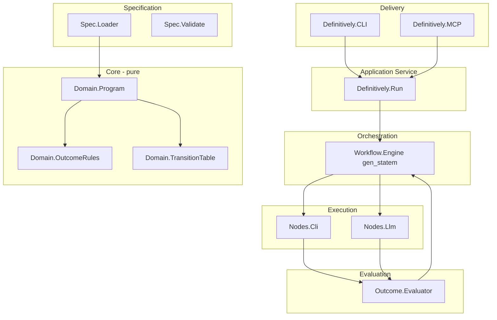
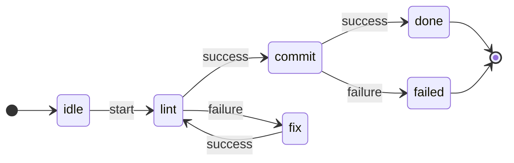
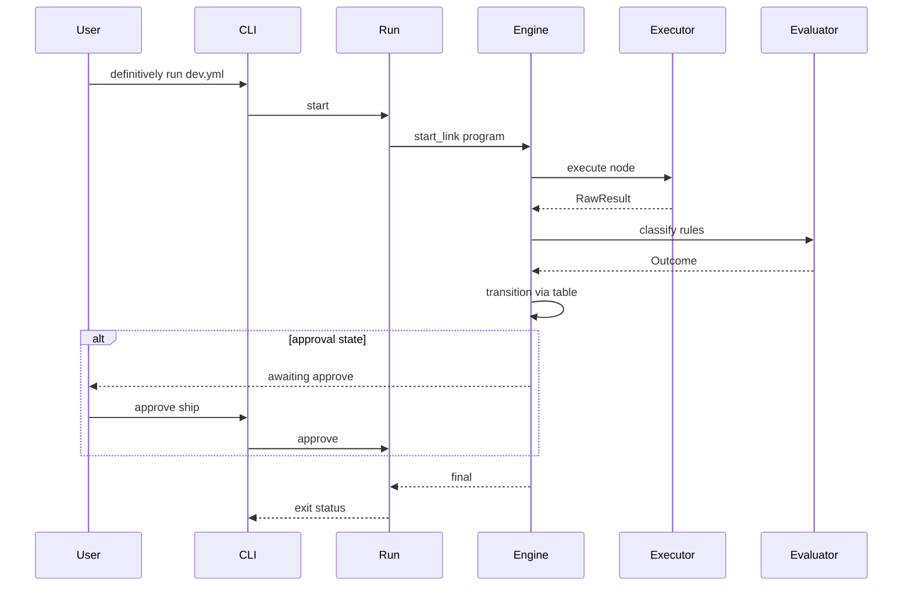

# FSM Workflow Definitively — Domain Model Plan

## Product decisions (locked in)

| Decision | Choice |
|----------|--------|
| Symphony / [WORKFLOW.md](WORKFLOW.md) | Out of scope; greenfield design |
| Human interaction | Auto transitions by default; optional **approval** states in YAML |
| Persistence | **Ephemeral** runs (in-memory + structured logs); no resume-after-crash v1 |
| Node executors v1 | **CLI** + **LLM** only |
| Outcome rules | **Medium** DSL: exit code, timeout, named signals, JSONPath/JQ on stdout or LLM JSON |

Existing code to evolve—not throw away:

- [`Definitively.Outcome`](definitively/lib/definitively/outcome.ex) — keep as the **verdict** value object after classification
- [`Definitively.Workflow.Engine`](definitively/lib/definitively/workflow/engine.ex) — replace hardcoded `linting/fixing/committing` with a **data-driven** `:gen_statem` driven by parsed YAML
- [`Definitively.Application`](definitively/lib/definitively/application.ex) — wire supervision when CLI/MCP land

Skills applied: **elixir-otp-design** (layers, gen_statem as service), **elixir-core** (pure core, tagged tuples), **elixir-concurrency** (Task for node execution, back-pressure later).

---

## Ubiquitous language

| Term | Meaning |
|------|---------|
| **Program** | Immutable workflow definition loaded from YAML (states, transitions, node catalog) |
| **State** | A named point in the FSM; may be `active` (runs a node), `approval` (waits for human), or `final` |
| **Node** | A reusable unit of work (CLI command or LLM turn) referenced by active states |
| **Run** | One execution of a program (ephemeral aggregate root for this process lifetime) |
| **Attempt** | One invocation of a node within a run (supports retries on same state) |
| **RawResult** | Uninterpreted output: exit code, streams, duration, LLM payload |
| **Outcome** | Classified result (`:success`, `:failure`, `:partial`, `:unknown`) + signals/artifacts |
| **Verdict label** | YAML-facing name for a transition key: `success`, `failure`, `partial`, `retry`, `abort` |
| **Transition** | `(current_state, verdict_label) -> next_state` from the program |

Keep **Outcome.status** as the FSM input; YAML never mentions `:gen_statem`—only verdict labels that map to status (and optional extra labels like `retry`).

---

## Bounded contexts (DDD)



### 1. Specification context

**Responsibility:** Load YAML → validated `Program` struct. No side effects.

Suggested modules under `lib/definitively/`:

- `Definitively.Domain.Program` — states, nodes, transitions, metadata
- `Definitively.Domain.NodeDefinition` — `type: cli | llm`, run config, `outcome` rules
- `Definitively.Domain.OutcomeRules` — list of predicates per verdict label
- `Definitively.Spec.Loader` — `load(path) :: {:ok, Program.t()} | {:error, SpecError.t()}`
- `Definitively.Spec.Validator` — cross-checks: all `on:` targets exist, one `initial`, reachable finals, node refs defined

**YAML shape (v1 sketch)** — single file per program:

```yaml
program:
  id: dev_quality_loop
  version: 1
  initial: idle

states:
  idle:
    type: passive
    on:
      start: lint

  lint:
    type: active
    node: mix_credo
    on:
      success: commit
      failure: fix
      partial: fix

  fix:
    type: active
    node: llm_fix
    on:
      success: lint
      failure: fix      # retry loop
      retry: fix

  commit:
    type: active
    node: git_commit
    on:
      success: done
      failure: failed

  await_ship:
    type: approval
    prompt: "Ship this change?"
    on:
      approve: done
      reject: failed

  done:
    type: final
  failed:
    type: final

nodes:
  mix_credo:
    kind: cli
    cwd: definitively
    command: ["mix", "credo", "--strict"]
    timeout_ms: 120000
    outcome:
      success:
        - exit_code: 0
      failure:
        - exit_code: {neq: 0}
      partial:
        - exit_code: 0
        - jq: ".warnings | length > 0"   # medium DSL on captured stdout if JSON

  llm_fix:
    kind: llm
    model: auto
    prompt_file: prompts/fix_credo.md
    timeout_ms: 600000
    outcome:
      success:
        - signal: fix_complete
        - jq: '.status == "ok"'          # on parsed LLM JSON envelope
      failure:
        - timeout: true
        - signal: refused

  git_commit:
    kind: cli
    command: ["git", "commit", "-m", "chore: auto"]
    outcome:
      success:
        - exit_code: 0
      failure:
        - exit_code: {neq: 0}
```

Design notes:

- **`states.*.on`** maps **verdict labels** → next state (not raw exit codes). The engine asks the evaluator for a label list or a primary label.
- **`type: approval`** does not run CLI/LLM; engine parks until `Run.approve/2` or MCP `workflow/approve`.
- **`nodes`** catalog is shared; states only reference by id.
- Optional **`vars`** / **`env`** at program level for `$WORKSPACE` substitution (boundary concern in Loader).

### 2. Core context (pure)

No `gen_statem`, no `System.cmd`, no HTTP.

| Function | Role |
|----------|------|
| `TransitionTable.build/1` | From program → map `{state, label} => state` |
| `TransitionTable.next/3` | Resolve transition or `{:error, :no_transition}` |
| `OutcomeRules.classify/2` | `rules, raw_result -> %Outcome{}` |
| `Program.active_node/2` | Node id for current active state |

**Predicate model (medium DSL)** — keep extensible via small set of clause types:

```elixir
# Conceptual — not implementation yet
%Predicate.ExitCode{eq: 0}
%Predicate.Timeout{}
%Predicate.Signal{name: "fix_complete", equals: true}
%Predicate.Jq{path: ".status", op: :eq, value: "ok", source: :stdout_json | :llm_json}
%Predicate.All{predicates: [...]}
%Predicate.Any{predicates: [...]}
```

Evaluation order for a node: for each verdict label in YAML order (`success`, then `failure`, …), if **all** predicates in that clause match → emit that label. If none match → `%Outcome{status: :unknown}` and engine uses `on.unknown` if present else stay/retry policy in program defaults.

Extend existing [`Outcome`](definitively/lib/definitively/outcome.ex):

- `verdict_label` field (atom/string) — which YAML branch fired
- `raw` optional reference or embedded summary for logs
- Keep `signals` / `artifacts` for LLM and CLI enrichers

### 3. Execution context

**Responsibility:** Run one node → `RawResult`. Side effects live here only.

```elixir
defmodule Definitively.Nodes.Executor do
  @callback execute(node :: NodeDefinition.t(), ctx :: RunContext.t()) ::
            {:ok, RawResult.t()} | {:error, term()}
end
```

| Module | Behavior |
|--------|----------|
| `Definitively.Nodes.Cli` | `System.cmd` / `Port` with timeout, capture stdout/stderr, cwd from ctx |
| `Definitively.Nodes.Llm` | Invoke agent (command template from ctx), parse stream → `RawResult` with optional JSON envelope |

`RunContext` — ephemeral struct: `workspace_root`, `env`, `run_id`, `attempt`, logger.

Run node work in **`Task.async`** under `Task.Supervisor` (supervision per elixir-otp-design); engine **calls** and waits (sync v1) so FSM stays simple.

### 4. Evaluation context

**Responsibility:** `RawResult` + `OutcomeRules` → `%Outcome{}`.

- `Definitively.Outcome.Evaluator` — delegates to core `OutcomeRules.classify/2`
- JQ implementation: shell out to `jq` in v1 (devenv already has tooling culture) or small Elixir library later; document dependency in program README

**Critical separation:** Executors must **not** decide success/failure beyond capturing facts (exit code, parsed JSON, timeouts). All semantics live in YAML + core classifier.

### 5. Orchestration context

**Responsibility:** Drive the run using `:gen_statem` + transition table.

Refactor [`Engine`](definitively/lib/definitively/workflow/engine.ex) from fixed states to **one generic callback module**:



Runtime data in `data` map:

- `program`, `run_id`, `current_state` (atom), `history` (list of transition events)
- `attempt_count` per state for retry limits (optional `max_attempts` in YAML)

**Events** (internal, not YAML):

| Event | When |
|-------|------|
| `:start` | Begin run from `initial` |
| `{:node_finished, outcome}` | After executor + evaluator |
| `{:approve, label}` | Human gate from CLI/MCP |
| `:cancel` | User abort |

**State types in engine:**

- `passive` — wait for `:start` or external trigger
- `active` — run node, classify, `TransitionTable.next/3`, maybe loop on `retry`
- `approval` — `{:keep_state}` until `{:approve, label}`
- `final` — reply `:finished` / `:failed`

Do **not** encode lint/fix/commit in module function names; use `handle_event/4` or single `dispatch/3` on state name from program.

### 6. Application / Run service

`Definitively.Run` — facade for CLI and MCP:

```elixir
start(program_path, opts) :: {:ok, run_id}
status(run_id) :: RunSnapshot.t()
approve(run_id, label) :: :ok | {:error, _}
cancel(run_id) :: :ok
```

Ephemeral: `Registry` or `DynamicSupervisor` + one `Engine` pid per run (no DB). `RunRegistry` holds `run_id → pid`.

### 7. Delivery context

| Surface | Commands / tools (illustrative) |
|---------|----------------------------------|
| **CLI** (`Definitively.CLI`) | `definitively run program.yml`, `status`, `approve reject`, `cancel` |
| **MCP** (`Definitively.MCP`) | `workflow_run`, `workflow_status`, `workflow_approve` — thin JSON over same `Run` API |

Both are **boundary** modules: parse args, call `Run`, format output. No FSM logic in CLI/MCP.

---

## End-to-end flow (one active state)



---

## What to change in the current prototype

| Current | Target |
|---------|--------|
| Hardcoded `linting/fixing/committing` in Engine | Table-driven states from `Program` |
| `{:node_result, %Outcome{}}` only | `{:node_finished, outcome}` + `{:approve, _}` |
| Demo in [`Definitively.run_demo/0`](definitively/lib/definitively.ex) | `run_demo` loads a fixture YAML |
| No spec layer | `Spec.Loader` + Validator |
| No executors | `Nodes.Cli`, `Nodes.Llm` behaviours |

---

## Suggested `lib/definitively/` layout (implementation phase)

```
lib/definitively/
  domain/
    program.ex
    node_definition.ex
    outcome_rules.ex
    transition_table.ex
    raw_result.ex
  spec/
    loader.ex
    validator.ex
  outcome/
    evaluator.ex
  nodes/
    executor.ex
    cli.ex
    llm.ex
  workflow/
    engine.ex          # data-driven gen_statem
    run_context.ex
  run/
    supervisor.ex
    registry.ex
    coordinator.ex     # Run facade
  cli.ex
  mcp.ex               # or separate app later
  outcome.ex           # existing, extended
  application.ex
```

Tests (elixir-testing): core classifier and transition table as pure tests; Engine with scripted `RawResult` stubs; one integration test with a fake CLI node (`:true` exit).

---

## Open design choices (defer, do not block v1)

- **Partial vs retry:** `partial` verdict can map to same transition as `failure` or dedicated path—YAML per state.
- **Parallel nodes:** Not v1; sequential FSM only.
- **Sub-workflows:** Call another program as a node—later.
- **MCP transport:** stdio vs HTTP—delivery detail after `Run` API is stable.

---

## Recommended next implementation slice (after plan approval)

1. **Core + Spec** — YAML types, loader, validator, transition table tests  
2. **Evaluator** — predicate structs + classify + extend `Outcome`  
3. **CLI executor** — minimal `echo` / `mix test` nodes  
4. **Engine refactor** — data-driven gen_statem + fixture program  
5. **Run + CLI** — `definitively run`  
6. **LLM executor** — agent command + JSON envelope  
7. **Approval + MCP** — human gates and tools  

This order keeps the FSM honest before adding LLM complexity.
