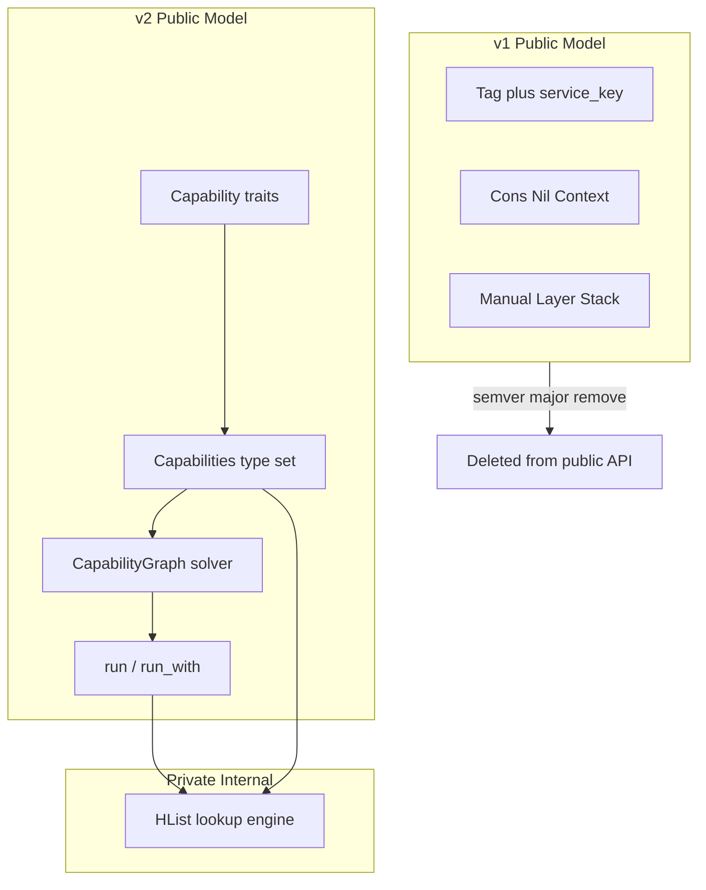
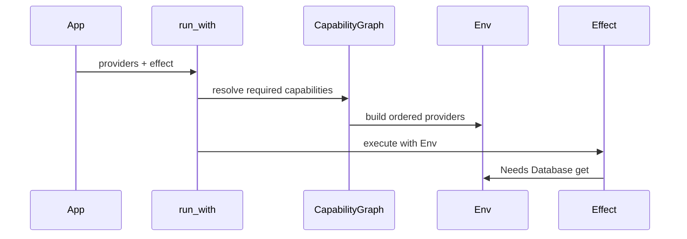
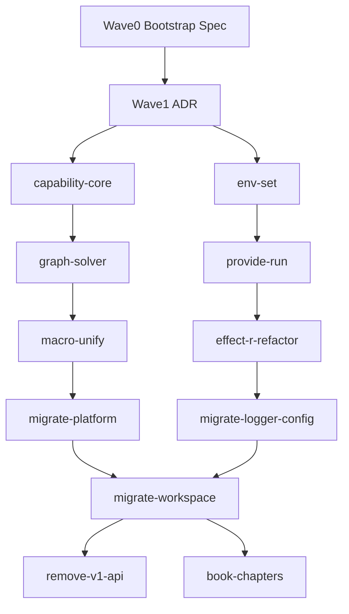

# id_effect v2 Capability DI — Maestro Hierarchical Plan

## Skills reviewed (before planning)

| Skill | Path | Role in this plan |
|-------|------|-------------------|
| maestro | [`.cursor/skills/maestro/SKILL.md`](.cursor/skills/maestro/SKILL.md) | Heavy-mode mission loop, wave dispatch |
| maestro-design | `~/.claude/skills/maestro-design/SKILL.md` | Grill protocol → product spec |
| maestro-mission | `~/.claude/skills/maestro-mission/SKILL.md` | Mission decompose + execution overlay |
| maestro-task | `~/.claude/skills/maestro-task/SKILL.md` | 1 task ↔ 1 PR claim/verify/ship |
| maestro-verify | `~/.claude/skills/maestro-verify/SKILL.md` | Witness levels, plan-check, verdict |
| maestro-handoff | `~/.claude/skills/maestro-handoff/SKILL.md` | 10 unpicked handoffs in MCP (foreign project); no id_effect envelopes |
| scrutinize | `.cursor/skills/engineering/scrutinize/SKILL.md` | **Missing in repo** — self-review applied inline per `/plan-hierarchically` checklist |
| scientific-method | `.cursor/skills/science/scientific-method/SKILL.md` | **Missing in repo** — trade-off section uses hypothesis/falsification framing inline |

---

## Reconnaissance digest

| Finding | Source | Implication |
|---------|--------|-------------|
| DI core is HList + Tag + Layer in `context/` + `layer/` | Codebase map subagent | Replace **public** surface; may keep HList as private impl detail |
| `LayerGraph::plan_topological` already solves requires/provides graphs | [`crates/id_effect/src/layer/graph.rs`](crates/id_effect/src/layer/graph.rs) | Auto-DI is an **extension**, not greenfield — promote to type/trait-aware `CapabilityGraph` |
| `id_effect_platform` already defines capability **traits** but still uses `service_key!` + `Get` + `layer_service` | [`crates/id_effect_platform/src/http.rs`](crates/id_effect_platform/src/http.rs) | Platform is the reference migration target |
| ~108 Rust files touch DI; `id_effect_axum`/`cli`/`rpc` are low-coupling | Blast-radius subagent | Clean break is feasible if all workspace crates migrate in same semver-major |
| `.maestro/` scaffold incomplete (`maestro doctor` fails) | Phase 0 bootstrap | **Wave 0 must run `maestro setup`** before materializing mission |
| No existing DI redesign spec/plan | Maestro-state subagent | New spec slug: **`id-effect-v2-capability-di`** |
| Book + 21 examples expose Cons/Tag/Layer | Blast-radius | Dedicated book/examples leaf required for clean break |

---

## Locked decisions (user-confirmed)

1. **Migration:** Clean break — semver-major; remove `Cons`, `Tag`, `service_key!`, `ctx!`, `req!` from public API in v2.0.
2. **Capability unit:** Trait-first — user writes `trait Database { … }`; keys/tags are **generated internally** (not user-facing).
3. **Internal representation:** HList may remain private under `id_effect::di::internal` for zero-cost lookup; external mental model is **unordered capability set**.
4. **Graph resolution:** Extend existing [`LayerGraph`](crates/id_effect/src/layer/graph.rs) semantics (duplicate/conflict/missing/cycle diagnostics) to trait-typed nodes — do not invent a parallel stringly planner.
5. **Entrypoint:** Single runtime surface: `run(app)` / `run_with(providers, app)` — no manual `Stack`/`merge` at app edge.

**Default if wrong:** If trait-object erasure blocks some hot paths, allow `#[capability(object_safe = false)]` with generic env cells only for those traits (documented exception, not dual public model).

---

## Scope

**In scope:** Core DI model, auto graph solver, unified macros, `Effect<A,E,R>` env typing, workspace crate migration, book/examples rewrite, semver-major release.

**Out of scope:** Full Effect.ts parity beyond DI; Definitively/Elixir work; changing `Effect` error algebra; runtime reflection-based DI.

---

## Phase 0 — Maestro bootstrap (Wave 0)

### leaf-maestro-init

**Context:** Maestro MCP reports tasks/missions dirs but `maestro doctor` fails — scaffold incomplete. No `.maestro/MAESTRO.md` on disk.

**Acceptance criteria:**
- Given repo root, when `devenv shell -- maestro setup` runs, then `.maestro/MAESTRO.md`, `tasks/`, `missions/`, `specs/`, `docs/principles/` exist.
- When `maestro doctor` runs, scaffold check passes.
- When `maestro status --json` runs, exit 0.

**Files:** Create `.maestro/*` scaffold via CLI; no application code.

**Gates:** `maestro doctor` exit 0 | witness: agent-claimed-locally

---

## Phase 1 — Product spec + architecture (Wave 0–1)

### leaf-spec-di-v2

**Context:** No Maestro spec exists for DI v2. Must precede mission materialization.

**Target state:** [`.maestro/specs/id-effect-v2-capability-di.md`](.maestro/specs/id-effect-v2-capability-di.md) with `mode: heavy`, acceptance criteria, non-goals, risk_class: high.

**Process:** Load `maestro-design` skill; grill against:
- Current [`context/README.md`](crates/id_effect/src/context/README.md) + [`layer/README.md`](crates/id_effect/src/layer/README.md)
- RFC 0001 capability direction ([`docs/effect-ts-parity/rfcs/0001-id-effect-platform.md`](docs/effect-ts-parity/rfcs/0001-id-effect-platform.md))
- User analysis (Tag→trait, auto graph, unified syntax)

**Acceptance criteria:**
- `maestro spec validate .maestro/specs/id-effect-v2-capability-di.md` exit 0.
- Spec lists explicit **removed public items**: `Cons`, `Nil`, `Tag`, `Tagged`, `Get`, `service_key!`, `req!`, `ctx!`, `Stack`, `layer_service`, etc.
- Spec defines target syntax (see Macro surface below).

**Maestro MCP after validate:**
```
maestro_mission_from_spec { spec_path: ".maestro/specs/id-effect-v2-capability-di.md" }
maestro_mission_decompose { mission_id: "pln-...", tasks: [ leaf slugs ] }
```

**Gates:** spec validate | plan-check (after plan file) | witness: witnessed-by-maestro

### leaf-adr-capability-model

**Context:** Foundational fork from Effect.ts Tag/Layer to Rust-native capability DI needs a committed ADR before code churn.

**Create:** [`docs/adrs/0002-capability-di-v2.md`](docs/adrs/0002-capability-di-v2.md)

**Must document:**
- Why trait-first (Rust idiom, object safety rules, test doubles)
- Why clean break vs shim (maintenance cost of dual API)
- Mapping table: v1 → v2 (see below)
- Object-safety / generic capability constraints
- Relationship to existing `EffectInterface` ([`algebra/interface.rs`](crates/id_effect/src/algebra/interface.rs))

**v1 → v2 mapping (locked in ADR):**

| v1 (removed public) | v2 (public) |
|---------------------|-------------|
| `service_key!` + `Tag<K>` | `#[capability]` on trait (generates internal key) |
| `Service<K,V>` / `Tagged<K,V>` | `Env::get::<dyn Database>()` or typed `Env::get::<impl Database>()` |
| `req!(K: V \| …)` | `Capabilities![Database, Logger, …]` type alias |
| `ctx!(K => v)` | `Env::of([provide(DatabaseLive), …])` or `run_with` |
| `Layer` / `Stack` / `layer_service` | `Provider<T>` + `CapabilityGraph::build()` |
| `Effect::provide(ctx)` | `run_with(providers, effect)` peels env at boundary |
| `NeedsHttpClient` + `Get` | `Needs<Database>` supertrait (blanket over env) |
| `~EffectLogger` + `IntoBind` | `require!(Database)` / `with(Database)` in `effect!` |

**Diagram (phase boundary):**



**Gates:** ADR reviewed in spec; `cargo doc --no-deps -p id_effect` still builds (doc-only change) | witness: agent-claimed-locally

---

## Phase 2 — Core capability runtime (Wave 1–2)

### leaf-capability-core

**Context:** Introduce new public module without yet deleting v1 exports (internal feature flag `di_v2` until removal leaf).

**Create/modify:**
- **Create** [`crates/id_effect/src/capability/mod.rs`](crates/id_effect/src/capability/mod.rs) — module root
- **Create** `capability/trait_.rs` — `Capability` marker trait + object-safety metadata
- **Create** `capability/id.rs` — internal `CapabilityId` (TypeId + optional name for diagnostics)
- **Create** `capability/needs.rs` — `Needs<C>` supertrait replacing per-crate `NeedsX` + raw `Get`
- **Modify** [`crates/id_effect/src/lib.rs`](crates/id_effect/src/lib.rs) — `pub mod capability` (gated until removal leaf)

**Public API additions:**
```rust
pub trait Capability: Send + Sync + 'static { /* marker */ }
pub trait Needs<C: Capability> { fn get_capability(&self) -> &C; }
```

**Acceptance criteria:**
- Unit tests: object-safe trait round-trip through env
- Compile fail test: non-object-safe trait without generic env errors with actionable message
- `Needs<C>` blanket impl over internal env storage

**Gates:** `cargo test -p id_effect capability::` 0 failures | witness: agent-claimed-locally

### leaf-env-set

**Context:** Replace user-visible `Context<Cons<…>>` with unordered `Env` / `Capabilities![…]`.

**Create:**
- `capability/env.rs` — `Env` runtime container (wraps private HList or type-map — **benchmark before choosing**; default: keep HList private for compile-time `Get` paths)
- `capability/set.rs` — `Capabilities![A, B, C]` type-level set (macro in `id_effect_macro`)

**Acceptance criteria:**
- Given `Capabilities![Database, Logger]`, when env built with both providers, then order of insertion does not affect `get::<Database>()`
- Missing capability yields `CapabilityError::Missing(CapabilityId)` at **build time** where possible, runtime at `run_with` boundary otherwise
- Snapshot test parity with [`testing/snapshot.rs`](crates/id_effect/src/testing/snapshot.rs) lookup behavior

**Diagram:**



**Gates:** unit + snapshot tests | witness: agent-claimed-locally

---

## Phase 3 — Auto graph solver (Wave 2)

### leaf-graph-solver

**Context:** [`LayerGraph`](crates/id_effect/src/layer/graph.rs) already topologically sorts string-keyed nodes with rich diagnostics. v2 promotes this to typed capability nodes.

**Create/modify:**
- **Create** `capability/graph.rs` — `CapabilityNode`, `CapabilityGraph`, reuse planner logic from `layer/graph.rs` (extract shared `topo_planner` module to avoid duplication)
- **Create** `capability/provider.rs` — `Provider<C>` trait: `fn provide(&self, deps: &Env) -> Result<C, ProviderError>`
- **Modify** `layer/graph.rs` — extract generic topo sort; keep v1 tests passing until removal leaf

**Acceptance criteria:**
- Given providers `{DbLive, RepoLive, ApiLive}` with `Repo requires Db`, graph builds `[Db, Repo, Api]` order
- Conflicting providers for same capability → `CapabilityDiagnostic` (reuse codes: `conflicting-provider`, `missing-provider`, `cycle-detected`)
- `CapabilityGraph::diagnostics()` returns actionable messages referencing **trait names**, not string service keys

**Scientific-method note (trade-off):**
- **Hypothesis H1:** TypeId-keyed graph is sufficient for all workspace providers.
- **Falsification:** Attempt two providers for same trait different generics (`Provider<DbPool>` vs `Provider<DbConn>`) — if ambiguous, require named capability variants in ADR amendment.

**Gates:** port all `layer/graph.rs` planner tests + new trait-keyed cases | witness: agent-claimed-locally

### leaf-provide-run

**Context:** Single app entrypoint — the primary DX win.

**Create:** `capability/run.rs`
```rust
pub fn run<A, E, Caps>(app: Effect<A, E, Caps>) -> Result<A, RunError<E>>
where Caps: CapabilitySet, ...;

pub fn run_with<A, E, Caps, I>(providers: I, app: Effect<A, E, Caps>) -> Result<A, RunError<E>>
where I: IntoIterator<Item = ProviderBox>, ...;
```

**Acceptance criteria:**
- Example app: zero manual `Stack`/`merge` — only `run_with([DbLive, LoggerLive], app)`
- Missing provider fails before effect execution with diagnostic listing missing trait
- Integration test mirrors [`examples/035_layer_graph.rs`](crates/id_effect/examples/035_layer_graph.rs) scenario using v2 API

**Gates:** example compiles + test | witness: agent-claimed-locally

---

## Phase 4 — Macro surface unification (Wave 3)

### leaf-macro-unify

**Context:** Eliminate "3 ways to do everything" — converge dependency syntax.

**Modify/create in [`id_effect_macro`](crates/id_effect_macro/):**
- **Create** `capability/capability.rs` — `capability!` / `#[capability]` attribute (generates internal id + `Provider` impl stub)
- **Create** `capability/provide.rs` — `provide!(DbLive)` sugar
- **Create** `capability/caps.rs` — `caps!(Database, Logger)` → `Capabilities![…]`
- **Modify** [`id_effect_proc_macro`](crates/id_effect_proc_macro/) — extend `effect!` with `require!(Database)` desugaring to env access (replace `~Tag` / `IntoBind` pattern)

**Target author syntax (locked):**
```rust
#[capability]
trait Database { fn query(&self, sql: &str) -> Effect<Rows, DbError, ()>; }

struct DatabaseLive { pool: Pool }

#[provides(Database)]
impl Provider for DatabaseLive { ... }

fn handler() -> Effect<Response, AppError, caps!(Database, Logger)> {
  effect! {
    let db = require!(Database);
    ...
  }
}

fn main() {
  run_with([DatabaseLive { ... }, LoggerLive::default()], handler()).unwrap();
}
```

**Acceptance criteria:**
- `trybuild` tests: old macros (`service_key!`, `req!`) removed from public re-exports produce clear compile errors pointing to migration guide
- Single example (`examples/040_capability_app.rs`) demonstrates full stack
- `id_effect_lint` updated for new fn signature patterns

**Gates:** `cargo test -p id_effect_macro`, `cargo test -p id_effect_proc_macro`, trybuild | witness: agent-claimed-locally

### leaf-effect-r-refactor

**Context:** [`Effect<A,E,R>`](crates/id_effect/src/kernel/effect.rs) third parameter becomes `R: CapabilitySet` instead of raw `Context<Cons<…>>`.

**Modify:**
- `kernel/effect.rs` — `provide` deprecated internal; public boundary is `run_with`
- `kernel/effect.rs` — `R` defaults / `()` for pure effects unchanged

**Acceptance criteria:**
- All existing `Effect<_,_,()>` code unchanged
- Capability effects require `Caps: CapabilitySet` bound
- `run_blocking(effect, env)` accepts `Env` where `Env: CapabilitySet`

**Gates:** `cargo test -p id_effect` full suite | witness: witnessed-by-ci (if CI enabled) else agent-claimed-locally

---

## Phase 5 — Downstream migration (Wave 4–5, parallel)

### leaf-migrate-platform

**Modify:** [`crates/id_effect_platform/src/{http,fs,process}.rs`](crates/id_effect_platform/src/http.rs)
- Remove public `HttpClientKey`, `service_key!`, `NeedsHttpClient`, `layer_http_client`
- Keep `HttpClient` trait; add `#[capability]` + `Provider` impls
- Update tests to `run_with` + `require!(HttpClient)`

**AC:** Platform crate has zero references to removed v1 symbols; docs updated.

### leaf-migrate-logger-config

**Modify:** [`crates/id_effect_logger/src/lib.rs`](crates/id_effect_logger/src/lib.rs), [`crates/id_effect_config/`](crates/id_effect_config/)
- Migrate `EffectLogger` to capability trait
- Replace four layer fns with `Provider` impls
- Config loading uses `Needs<ConfigCapability>`

**AC:** Logger/config integration tests pass; thread-local test helpers preserved.

### leaf-migrate-workspace

**Modify remaining ~65 files:** examples (21), `id_effect_reqwest`, `id_effect_tower`, `id_effect_tokio` example, `id_effect_lint`, book chapters part 2 ch04–ch07.

**AC:** `rg 'service_key!|Context<Cons|req!|ctx!' crates/` returns 0 matches outside `di/internal` and migration notes.

**Parallelism:** `leaf-migrate-platform`, `leaf-migrate-logger-config` can run as **parallel subagents** after Wave 3 merges.

---

## Phase 6 — Clean break removal (Wave 6)

### leaf-remove-tag-cons-api

**Context:** Semver-major cut — delete public v1 surface.

**Delete/deprivilege:**
- Public re-exports from [`lib.rs`](crates/id_effect/src/lib.rs): `Cons`, `Nil`, `Tag`, `Tagged`, `Get`, `GetMut`, `Here`, `Skip*`, `service_key`, `req`, `ctx`, `Stack`, `layer_service`, etc.
- Move surviving HList engine to `id_effect::di::internal` (pub(crate) only)
- Remove or rewrite [`context/README.md`](crates/id_effect/src/context/README.md) → `capability/README.md`

**Acceptance criteria:**
- `cargo doc -p id_effect` shows no Cons/Tag/Layer in public docs
- CHANGELOG.md major section documents breaking changes + migration table
- Version bump to 2.0.0 in workspace `Cargo.toml`

**Rollback:** Git revert + yank crate release if critical regression; no runtime feature flag once shipped.

**Gates:** full workspace `cargo test --workspace`; `cargo clippy --workspace -- -D warnings` | witness: witnessed-by-ci

### leaf-book-chapters

**Rewrite:** [`crates/id_effect/book/src/part2/`](crates/id_effect/book/src/part2/) ch04–ch07 + appendix-b migration
- Remove tuple-R / Cons tutorials
- Add capability-first narrative aligned with `examples/040_capability_app.rs`

**Gates:** `mdbook build` in id_effect book | witness: agent-claimed-locally

---

## Execution overlay (heavy mode)

Write [`.maestro/missions/id-effect-v2-capability-di.execution.md`](.maestro/missions/id-effect-v2-capability-di.execution.md):

| Wave | Tasks (slug) | Parallel? | Blocked by |
|------|--------------|-----------|------------|
| 0 | leaf-maestro-init, leaf-spec-di-v2 | sequential | — |
| 1 | leaf-adr-capability-model | no | wave 0 |
| 2 | leaf-capability-core, leaf-env-set | yes | wave 1 |
| 3 | leaf-graph-solver, leaf-provide-run | yes | wave 2 |
| 4 | leaf-macro-unify, leaf-effect-r-refactor | yes | wave 3 |
| 5 | leaf-migrate-platform, leaf-migrate-logger-config | **yes (2 subagents)** | wave 4 |
| 6 | leaf-migrate-workspace | no | wave 5 |
| 7 | leaf-remove-tag-cons-api, leaf-book-chapters | yes | wave 6 |

**Rule:** Do not claim wave N+1 until wave N tasks are `shipped`.

---

## Dependency graph



---

## Quality gates (mission rollup)

| Gate | Command | Pass |
|------|---------|------|
| Spec | `maestro spec validate .maestro/specs/id-effect-v2-capability-di.md` | exit 0 |
| Plan | `maestro plan check --task <tsk> --plan-file .cursor/plans/id-effect-v2-capability-di.plan.md` | no scope-widen |
| Unit | `cargo test --workspace` | 0 failures |
| Lint | `cargo clippy --workspace -- -D warnings` | clean |
| DI grep | `rg 'service_key!|Context<Cons|pub use.*Cons' crates/` | 0 public hits |
| Book | `mdbook build` (id_effect book) | success |
| Maestro verify | `maestro task verify <each tsk>` | exit 0 per leaf |

---

## Risks and mitigations

| Risk | Severity | Mitigation |
|------|----------|------------|
| Object-safe trait limits for generic capabilities | High | ADR documents `CapabilityRef` vs generic env cells; compile_fail tests |
| Clean break breaks downstream users | High | Migration guide in book appendix-b; CHANGELOG mapping table |
| HList removal hurts compile-time perf | Medium | Keep private HList; benchmark env lookup before type-map switch |
| Macro complexity (`effect!` + `require!`) | Medium | Incremental: `require!` first, deprecate `~Tag` in same release |
| Maestro scaffold drift | Low | Wave 0 `maestro setup` before any task claims |

---

## Maestro artifacts to produce (post-approval)

1. `.maestro/specs/id-effect-v2-capability-di.md`
2. `.maestro/missions/id-effect-v2-capability-di.md` (sidecar)
3. `.maestro/missions/id-effect-v2-capability-di.execution.md`
4. `.cursor/plans/id-effect-v2-capability-di.plan.md` (this plan, verbatim + frontmatter)
5. `docs/adrs/0002-capability-di-v2.md`
6. Mission id `pln-…` + 13 child tasks `tsk-…` via MCP decompose

---

## Self-review (scrutinize inline)

- **Simpler alternative?** Hide Cons but keep Tag public — rejected per user clean-break + trait-first choice.
- **Trace:** All cited paths verified by subagents and ctx_read; `.maestro/` absent confirmed.
- **Verify:** Each leaf has AC + gates; no TBD sections.
- **Parallelism:** Waves 2, 3, 4, 5, 7 explicitly parallelizable.

**Do not implement until:** spec validated, mission decomposed, plan-check PASS, user approves this plan.
