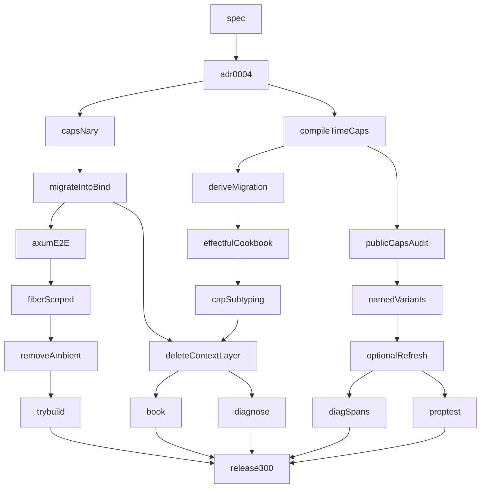

# id_effect v2 DI Maturity — Maestro Hierarchical Plan

## Skills reviewed

| Skill | Path | Role |
|-------|------|------|
| maestro | [`.cursor/skills/maestro/SKILL.md`](.cursor/skills/maestro/SKILL.md) | Heavy-mode waves, 1 task ↔ 1 PR |
| maestro-design | [`~/.claude/skills/maestro-design/SKILL.md`](~/.claude/skills/maestro-design/SKILL.md) | Grill → `.maestro/specs/id-effect-v2-di-maturity.md` |
| maestro-mission | [`~/.claude/skills/maestro-mission/SKILL.md`](~/.claude/skills/maestro-mission/SKILL.md) | Mission decompose + execution overlay |
| maestro-task | [`~/.claude/skills/maestro-task/SKILL.md`](~/.claude/skills/maestro-task/SKILL.md) | claim / verify / ship loop |
| maestro-verify | [`~/.claude/skills/maestro-verify/SKILL.md`](~/.claude/skills/maestro-verify/SKILL.md) | Witness levels, plan-check |
| maestro-handoff | [`~/.claude/skills/maestro-handoff/SKILL.md`](~/.claude/skills/maestro-handoff/SKILL.md) | Inbox (empty this session) |
| scrutinize | `.cursor/skills/engineering/scrutinize/SKILL.md` | **Missing** — inline self-review |
| scientific-method | `.cursor/skills/science/scientific-method/SKILL.md` | **Missing** — trade-offs inline |
| Elixir skills | `.cursor/skills/elixir/*` | Reviewed, **not used** |

---

## Reconnaissance digest

| Finding | Source | Implication |
|---------|--------|-------------|
| Completion mission **shipped**; infra exists (`CapEnv*`, `caps!`, `require!`, derive, scoped env) | [`.maestro/missions/id-effect-v2-di-completion.execution.md`](.maestro/missions/id-effect-v2-di-completion.execution.md) | This mission is **adoption + hardening**, not greenfield |
| **0** live `caps!(…)` call sites; **0** `` / `derive(ProviderSpec)` user adoption | Codebase map subagent | Leaves #1,#2,#6,#8 are the critical path |
| **7** `IntoBind` refs in logger/config; v1 `context/`/`layer/` still **public** via `HasTag`, `Matcher`, `Effect::provide` | Blast-radius subagent | Leaves #5,#9 blocked until migration (#5 first) |
| trybuild: **2** cases only | `crates/id_effect/tests/ui/` | Leaf #11 expands corpus |
| `ambient.rs` deprecated, **16** internal refs in config only | Config map | Leaf #10 is low-risk, isolated |
| `id_effect` **2.0.0** vs `id_effect_platform` **0.3.0** | Cargo.toml | Leaf #20 coordinates semver |
| No successor spec after `id-effect-v2-di-completion` | Maestro state subagent | New slug: **`id-effect-v2-di-maturity`** |
| `maestro_setup_check` **ok**; handoffs **empty** | Maestro MCP Phase 0 | Ready to plan |

---

## Locked decisions

1. **Scope:** All 20 post-completion directions — one heavy mission, 20 leaves, 10 waves.
2. **No backwards compatibility:** No deprecation periods, alias types, dual APIs, or `#[deprecated]` retention. Remove legacy symbols in the same release that introduces replacements. Workspace migrates atomically.
3. **Semver:** **id_effect 0.3.0** semver-major (leaf #20); **id_effect_platform 4.0.0** (depends on id_effect 3.0). No 2.1.x intermediate.
4. **Compile-time caps:** **Mandatory** from Wave 2 — all multi-capability public effects use `caps!(…)`; proc-macro infers required caps from `require!(K)` in `effect!`. **Ban** public `Effect<_, _, Env>` and bare `Effect<_, _, ()>` when body uses capabilities.
5. **Cap typing:** **Delete** `CapEnv1…CapEnv6`; single model: const-generic `CapList` + `caps!` only (#2).
6. **Macro surface:** **Delete** `caps!`, `require!(env, K)`, manual `impl ProviderSpec` in workspace crates — only ``, `require!(K)`, `#[derive(ProviderSpec)]`.
7. **context/layer:** **Full delete** of `context/`, `layer/`, `id_effect_macro/src/layer/`, `IntoBind`, `Effect::provide` — no `di_internal` HList engine (#9). `HasTag`/`Matcher` move to standalone module first.
8. **config ambient:** **Delete** `ambient.rs` and all call sites in same PR — no deprecated stub (#10).

---

## Non-goals (clean break)

- Deprecation periods or `#[deprecated]` stubs for removed APIs
- `CapEnv1…6` alias types alongside `CapList`
- `caps!`, `require!(env, K)`, `IntoBind`, `Effect::provide`, config `ambient`
- Public `Effect<_, _, Env>` for multi-capability handlers
- `di_internal` HList retention "for macros only"

## Executive summary

v2 DI Completion built the runtime and macros; **the workspace still codes against v1 patterns** (`IntoBind`, bare `Env`, hand-written `ProviderSpec`). This mission is a **second clean break**: typed caps become the **only** public contract, all legacy APIs are **deleted** (not deprecated), v1 modules are removed entirely, and **0.3.0** ships with a breaking-change migration guide.

---

## Phase 0 — Bootstrap (Wave 0)

### leaf-spec-di-maturity

**Context:** No spec exists after `id-effect-v2-di-completion`. [`NOW.md`](.maestro/tasks/NOW.md) references a missing plan file — this leaf creates spec + updates NOW.

**Create:** [`.maestro/specs/id-effect-v2-di-maturity.md`](.maestro/specs/id-effect-v2-di-maturity.md) — `mode: heavy`, `risk_class: high`, 20 ACs mapped 1:1 to leaves below.

**AC:**
- `devenv shell -- maestro spec validate .maestro/specs/id-effect-v2-di-maturity.md` exit 0
- `maestro_mission_from_spec` + `maestro_mission_decompose` → `pln-…` + 20 `tsk-…`

**Gates:** spec validate | witness: witnessed-by-maestro

---

## Phase 1 — Architecture (Wave 1)

### leaf-adr-0004-provider-parity

**Context:** Effect.ts Layer has refresh, shared memoization, optional deps — not documented for v2.

**Create:** [`docs/adrs/0004-provider-parity-and-cap-subtyping.md`](docs/adrs/0004-provider-parity-and-cap-subtyping.md)

**Must cover:** optional caps in graph, refresh intervals, shared singleton semantics, cap-set subtyping/widening rules, compile-time bundle validation strategy.

**AC:** ADR linked from [`capability/README.md`](crates/id_effect/src/capability/README.md); `cargo doc -p id_effect` builds.

**Gates:** doc build | witness: agent-claimed-locally

---

## Phase 2 — Type-system foundation (Wave 2, parallel)

### leaf-caps-n-ary-unbounded *(#2)*

**Context:** [`caps.rs`](crates/id_effect_macro/src/capability/caps.rs) hard-stops at `CapEnv6`; [`set.rs`](crates/id_effect/src/capability/set.rs) uses macro-generated `CapEnv1…6`.

**Modify:** Introduce `CapList<const N: usize, …>` + update `caps!` for arbitrary arity. **Delete** `CapEnv1…CapEnv6` types and all re-exports from [`lib.rs`](crates/id_effect/src/lib.rs) / [`mod.rs`](crates/id_effect/src/capability/mod.rs).

**AC:**
- `caps!(K0, …, K7)` compiles and verifies at `run_with`
- `rg 'CapEnv[1-6]' crates/` → 0 matches
- trybuild: `CapEnv1` / old patterns produce compile errors with migration pointer

**Gates:** `cargo test -p id_effect capability::set` | witness: agent-claimed-locally

---

### leaf-compile-time-caps-enforcement *(#1, #4 partial)*

**Context:** `CapEnv::verify` is runtime-only; **0** `caps!` call sites.

**Modify:**
- [`id_effect_proc_macro/src/transform.rs`](crates/id_effect_proc_macro/src/transform.rs) — track `require!(K)` keys in `effect!`; **require** inferred `caps!(…)` on enclosing `Effect` return type (rustc error if mismatch)
- [`kernel/effect.rs`](crates/id_effect/src/kernel/effect.rs) — public multi-cap effects **must** use `R: CapabilitySet` via `caps!(…)`; remove `Env` as acceptable public `R`
- **Delete** `require!(env, K)` macro arm from [`require.rs`](crates/id_effect_macro/src/capability/require.rs)
- Lint + trybuild: public `Effect<_,_,Env>` when body uses `require!(K)` → hard error

**AC:**
- Handler with `require!(CounterKey)` but `Effect<_,_,()>` or `Effect<_,_,Env>` **fails compile**
- `require!(env, CounterKey)` fails compile with migration message
- `providers!(dev: […])` + `app: Effect<_,_,caps!(…)>` — missing provider fails at compile time where statically known, else at `run_with` boundary

**Gates:** trybuild + unit tests | witness: agent-claimed-locally

---

## Phase 3 — Workspace migration (Wave 3, parallel)

### leaf-migrate-intobind-crates *(#5)*

**Context:** [`id_effect_logger/src/lib.rs`](crates/id_effect_logger/src/lib.rs) (5 `IntoBind`), [`id_effect_config/src/provider.rs`](crates/id_effect_config/src/provider.rs) (2), reqwest doc-only legacy.

**Modify:** Replace `~EffectLogKey` / `IntoBind` with `Needs<K>` + `require!`; update tests and book snippets.

**AC:** `rg 'IntoBind' crates/` → 0 matches; remove `IntoBind` trait from [`kernel/effect.rs`](crates/id_effect/src/kernel/effect.rs) if no longer needed

**Gates:** `cargo test -p id_effect_logger -p id_effect_config -p id_effect_platform::http::reqwest` | witness: witnessed-by-ci

---

### leaf-public-caps-audit *(#6)*

**Context:** Lint `NO_CONCRETE_ENV_IN_PUB_API` exists but under-enforced; many public `Effect<_,_,Env>` signatures.

**Modify:** Audit + migrate public effect fns in `id_effect_platform`, `id_effect_config`, `id_effect_logger`, `id_effect_platform::http::reqwest` to `caps!(…)` or `R: Needs<K> + 'static` without concrete `Env`.

**AC:** `rg 'Effect<[^>]+Env>' crates/ --glob '*.rs'` → 0 hits (including examples and tests — all migrate to `caps!(…)>`)

**Gates:** `cargo test --workspace` + lint | witness: agent-claimed-locally

---

### leaf-provider-derive-migration *(#8)*

**Context:** **13** manual `impl ProviderSpec`; **0** derives.

**Modify:** Migrate **all** workspace `impl ProviderSpec` to `` + `#[derive(ProviderSpec)]`. **Delete** [`caps!`](crates/id_effect_macro/src/capability/define.rs) macro and public re-export.

**AC:** `rg 'caps!|impl ProviderSpec for' crates/ --glob '*.rs'` → 0 matches outside proc-macro internals; `040_capability_app.rs` uses attribute + derive only

**Gates:** `cargo test -p id_effect_platform -p id_effect_logger` | witness: agent-claimed-locally

---

## Phase 4 — Reference apps (Wave 4, parallel)

### leaf-axum-e2e-reference *(#7)*

**Create:** [`crates/id_effect_axum/examples/020_capability_run_with.rs`](crates/id_effect_axum/examples/020_capability_run_with.rs) — `build_env` → `State<Env>` → `run_with_caps` → `effect! { require!(…) }`.

**Modify:** Book [`ch07-05-tokio-bridge.md`](crates/id_effect/book/src/part2/ch07-05-tokio-bridge.md) + new axum section.

**AC:** Example runs under `cargo run -p id_effect_axum --example 020_capability_run_with`

**Gates:** example + axum integration test | witness: agent-claimed-locally

---

### leaf-named-variant-examples *(#13)*

**Context:** `CapabilityId::variant()` + graph conflicts exist; no production example.

**Create:** Example primary/replica DB providers with `@named` / `ProviderSpec::variant()`.

**AC:** Two providers same key type, different variants; graph builds without `ConflictingProvider`; integration test selects by variant

**Gates:** unit + example | witness: agent-claimed-locally

---

### leaf-effectful-provider-cookbook *(#14)*

**Context:** `provide_effect` / `effectful_build()` unused in examples.

**Create:** [`examples/042_effectful_config_provider.rs`](crates/id_effect/examples/042_effectful_config_provider.rs) — config load via Effect before app runs.

**AC:** `run_with` executes effectful provider in topo order; test asserts env populated before app effect

**Gates:** example + test | witness: agent-claimed-locally

---

## Phase 5 — Advanced runtime (Wave 5, parallel)

### leaf-fiber-scoped-caps *(#15)*

**Modify:** [`capability/env.rs`](crates/id_effect/src/capability/env.rs) + [`concurrency/fiber_ref.rs`](crates/id_effect/src/concurrency/fiber_ref.rs) — fiber-local cap override stack; axum middleware sets request-scoped cap.

**AC:** Nested fiber override restores parent; axum test sees per-request cap value

**Gates:** unit + axum test | witness: agent-claimed-locally

---

### leaf-optional-refreshable-providers *(#16)*

**Per ADR 0004.** Extend [`ProviderSpec`](crates/id_effect/src/capability/provider.rs) + [`CapabilityGraph`](crates/id_effect/src/capability/graph.rs):
- Optional deps (skip if absent)
- Shared memoized singleton (`Arc` cache)
- Refresh hook / TTL

**AC:** Graph builds with optional dep absent; shared provider constructed once; refresh test

**Gates:** graph unit tests | witness: agent-claimed-locally

---

### leaf-capset-subtyping *(#3)*

**Implement ADR 0004 subtyping:** `CapEnv<A> ⊆ CapEnv<A,B>` widening for function returns; trait `CapWiden` or equivalent.

**AC:** `fn f() -> Effect<_, _, caps!(Db)>` assignable where `caps!(Db, Log)` expected via widening rule; compile_fail for invalid narrow

**Gates:** trybuild + unit | witness: agent-claimed-locally

---

## Phase 6 — v1 teardown (Wave 6, parallel)

### leaf-remove-config-ambient *(#10)*

**Delete:** [`id_effect_config/src/ambient.rs`](crates/id_effect_config/src/ambient.rs) and **all** re-exports from [`lib.rs`](crates/id_effect_config/src/lib.rs) — no deprecated stubs left in tree.

**Modify:** [`config_desc.rs`](crates/id_effect_config/src/config_desc.rs) → scoped `Env` only; update [`041_scoped_config_provider.rs`](crates/id_effect/examples/041_scoped_config_provider.rs).

**AC:** `rg 'ambient|with_config_provider|current_config_provider' crates/` → 0; config tests pass

**Gates:** `cargo test -p id_effect_config` | witness: agent-claimed-locally

---

### leaf-delete-context-layer *(#9)*

**Context:** HIGH blast radius — `HasTag`/`Matcher` public, `Effect::provide` uses `layer::service`, `needs.rs` bridges `Context`.

**Modify:**
- Move `HasTag`/`Matcher` to standalone [`match_`](crates/id_effect/src/context/match_.rs) module (no HList deps)
- **Delete** `Effect::provide`, `IntoBind`, v1 layer re-exports from [`lib.rs`](crates/id_effect/src/lib.rs)
- **Delete** [`context/`](crates/id_effect/src/context/) (except relocated match_), [`layer/`](crates/id_effect/src/layer/), [`id_effect_macro/src/layer/`](crates/id_effect_macro/src/layer/), [`id_effect_macro/src/context/`](crates/id_effect_macro/src/context/) legacy macros (`ctx!`, `req!`, `service_key!`)
- Remove `Needs` bridge for `Context<L>` in [`needs.rs`](crates/id_effect/src/capability/needs.rs)

**AC:** `rg 'context/|layer/|IntoBind|service_key!|ctx!|req!' crates/` → 0; workspace tests pass; trybuild corpus covers every removed symbol

**Gates:** `cargo test --workspace` | witness: witnessed-by-ci

**Blocked by:** leaf-migrate-intobind-crates

---

## Phase 7 — Quality & docs (Wave 7, parallel)

### leaf-trybuild-corpus-full *(#11)*

**Expand:** [`crates/id_effect/tests/ui/`](crates/id_effect/tests/ui/) to ≥12 cases: `ctx!`, `req!`, conflicting providers, invalid `#[provides]`, cap mismatch, etc.

**AC:** `cargo test -p id_effect --test ui_compile_fail` pass; each stderr references appendix-b path

**Gates:** ui test | witness: witnessed-by-ci

---

### leaf-book-final-purge *(#12)*

**Modify:** Rename ch05 "hlists" filenames; archive `034–036` layer examples to `examples/archived/`; update [`examples/README.md`](crates/id_effect/examples/README.md).

**AC:** `mdbook build` in id_effect book; no chapter teaches `Layer::stack` as primary path

**Gates:** mdbook build | witness: agent-claimed-locally

---

### leaf-diagnose-manifests *(#17)*

**Extend:** [`id-effect-diagnose`](crates/id_effect_cli/src/bin/id-effect-diagnose.rs) — read TOML/JSON provider manifest; `--json` for CI.

**AC:** CLI loads fixture manifest; reports missing/conflicting providers; exit non-zero on error

**Gates:** CLI test | witness: agent-claimed-locally

---

### leaf-capability-diagnostics-spans *(#18)*

**Modify:** [`CapabilityPlannerError`](crates/id_effect/src/capability/error.rs) + macro expansions — preserve call-site context; integrate `thiserror` sources.

**AC:** Missing-cap error message includes provider id + cap name + suggested `provide!(…)`; snapshot test stable

**Gates:** unit snapshot | witness: agent-claimed-locally

---

### leaf-graph-proptest *(#19)*

**Create:** [`crates/id_effect/tests/graph_proptest.rs`](crates/id_effect/tests/graph_proptest.rs) — proptest topo order, cycle detection, variant conflicts.

**AC:** proptest runs 256 cases; no panics; invariants documented in test module

**Gates:** `cargo test -p id_effect graph_proptest` | witness: agent-claimed-locally

---

## Phase 8 — Release (Wave 8)

### leaf-release-3-0-0 *(#20)*

**Modify:** Workspace `Cargo.toml` versions → **id_effect 0.3.0**, **id_effect_platform 4.0.0**; [`CHANGELOG.md`](CHANGELOG.md) breaking section; book [`appendix-b-migration.md`](crates/id_effect/book/src/appendix-b-migration.md) 2.x→3.0 mapping table.

**AC:**
- All workspace crates version-aligned; no `2.x` compat re-exports
- `cargo test --workspace` + `cargo clippy --workspace -- -D warnings` clean
- Migration guide lists **every removed symbol** with replacement (no "deprecated for one release" entries)

**Gates:** full workspace verify | witness: witnessed-by-ci

**Blocked by:** all prior waves

---

## Execution overlay

Write [`.maestro/missions/id-effect-v2-di-maturity.execution.md`](.maestro/missions/id-effect-v2-di-maturity.execution.md):

| Wave | Tasks (slug) | Parallel? | Blocked by |
|------|--------------|-----------|------------|
| 0 | leaf-spec-di-maturity | no | — |
| 1 | leaf-adr-0004-provider-parity | no | wave 0 |
| 2 | leaf-caps-n-ary-unbounded, leaf-compile-time-caps-enforcement | **yes** | wave 1 |
| 3 | leaf-migrate-intobind-crates, leaf-public-caps-audit, leaf-provider-derive-migration | **yes** | wave 2 |
| 4 | leaf-axum-e2e-reference, leaf-named-variant-examples, leaf-effectful-provider-cookbook | **yes** | wave 3 |
| 5 | leaf-fiber-scoped-caps, leaf-optional-refreshable-providers, leaf-capset-subtyping | **yes** | wave 4 |
| 6 | leaf-remove-config-ambient, leaf-delete-context-layer | **yes** | wave 5; layer leaf also blocked by migrate-intobind |
| 7 | leaf-trybuild-corpus-full, leaf-book-final-purge, leaf-diagnose-manifests, leaf-capability-diagnostics-spans, leaf-graph-proptest | **yes** | wave 6 |
| 8 | leaf-release-3-0-0 | no | wave 7 |

---

## Dependency graph

---

## Mission rollup quality gates

| Gate | Command | Pass |
|------|---------|------|
| Spec | `maestro spec validate .maestro/specs/id-effect-v2-di-maturity.md` | exit 0 |
| Unit | `cargo test --workspace` | 0 failures |
| Lint | `cargo clippy --workspace -- -D warnings` | clean |
| IntoBind | `rg 'IntoBind' crates/` | 0 |
| v1 public | `rg 'pub use.*layer|pub.*Cons' crates/id_effect/src/lib.rs` | 0 |
| caps adoption | `rg 'caps!' crates/ --glob '*.rs'` | ≥10 call sites |
| legacy APIs | `rg 'CapEnv|caps!|IntoBind|ambient|service_key!' crates/` | 0 |
| trybuild | `cargo test -p id_effect --test ui_compile_fail` | pass |
| Book | `mdbook build` | success |

---

## Risks and mitigations

| Risk | Severity | Mitigation |
|------|----------|------------|
| 0.3.0 breaks downstream users | High | Explicit CHANGELOG + appendix-b mapping; no shim layer (user choice) |
| Compile-time caps macro complexity | High | Wave 2 blocked until CapList lands; trybuild gates every leaf |
| context/layer deletion breaks matchers | High | Relocate `HasTag`/`Matcher` in same PR as deletion |
| CapList const-generic complexity | Medium | ADR 0004 documents encoding; falsify with integration tests, not alias fallback |
| 20-leaf scope | Medium | Strict wave gates; no compat scope creep |

---

## Self-review (scrutinize inline)

- **Simpler alternative?** Single "migration only" mission without advanced provider parity — rejected; user asked for all 20 directions.
- **Trace:** All paths verified by parallel subagents; adoption counts grounded in rg.
- **Verify:** Every leaf has AC + gates; no TBD.
- **Parallelism:** Waves 2–7 explicitly parallelizable.

---

## Maestro artifacts to produce (post-approval)

1. `.maestro/specs/id-effect-v2-di-maturity.md`
2. `.maestro/missions/id-effect-v2-di-maturity.md` (sidecar)
3. `.maestro/missions/id-effect-v2-di-maturity.execution.md`
4. `.cursor/plans/id-effect-v2-di-maturity.plan.md` (this plan)
5. `docs/adrs/0004-provider-parity-and-cap-subtyping.md`
6. Mission `pln-…` + 20 child tasks via MCP decompose

**Do not implement until:** spec validated, mission decomposed, plan-check PASS, user approves.
