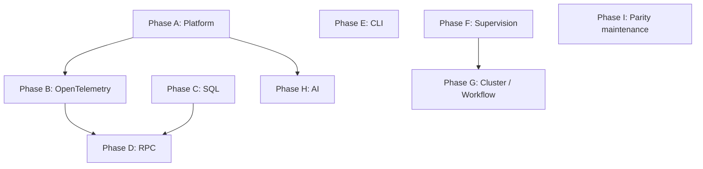

# Cross-phase dependencies and sequencing

This graph guides **when** to open or prioritize phase epics in Beads. Edges mean: **downstream is blocked by upstream** until the upstream epic’s *gating tasks* are done (not necessarily every leaf task).

## Mermaid — suggested blocking relationships



## Interpretation

| Edge | Rationale |
|------|-----------|
| **A → B** | OTEL layers should attach to **stable platform boundaries** (HTTP spans, process names, FS paths). You *can* prototype B earlier, but production-quality wiring assumes A’s service tagging conventions. |
| **A → H** | AI vendor clients need an **HTTP execution context** consistent with platform traits (timeouts, tracing propagation hooks). |
| **F → G** | Durable workflows and cluster-style execution assume **supervision/restart** semantics for long-running fibers. |
| **B → D** | RPC guides and examples should show **trace context** over the wire; optional but strongly recommended before public RPC examples ship. |
| **C → D** | “Full stack” RPC examples in the book often pair with **SQL**; the RPC phase can start thin without C, but **reference examples** should wait for C. |

## Phases that can start in parallel

- **A** and **F** (supervision) touch different subsystems; parallelize with separate owners.
- **E** (CLI) is largely orthogonal to A–D until you want a unified “binary template” in the book.
- **I** (maintenance) runs continuously from day one; file recurring `chore` issues under it.

## Suggested epic order for a single team

1. **I** — file the epic and recurring parity tasks (low friction).
2. **A** — platform traits (unblocks B and H at quality).
3. **B** — OTEL.
4. **C** — SQL (one driver first).
5. **F** — supervision (can overlap with C).
6. **D** — RPC (examples gated on B + C as above).
7. **E** — CLI when developer experience rises in priority.
8. **H** — AI after A’s HTTP story is stable.
9. **G** — last; research spike before committing.

## Beads: encoding cross-phase deps

After creating phase epics `EPIC_A`, `EPIC_B`, …:

```bash
# Example: Phase B blocked until Phase A epic closes (strict gate)
bd dep add EPIC_B EPIC_A

# Lighter weight: block only a *task* inside B on a *task* inside A
bd dep add EPIC_B.3 EPIC_A.1
```

Prefer **task-level** deps when the whole phase is not a hard gate — Beads’ ready queue stays more parallel.
