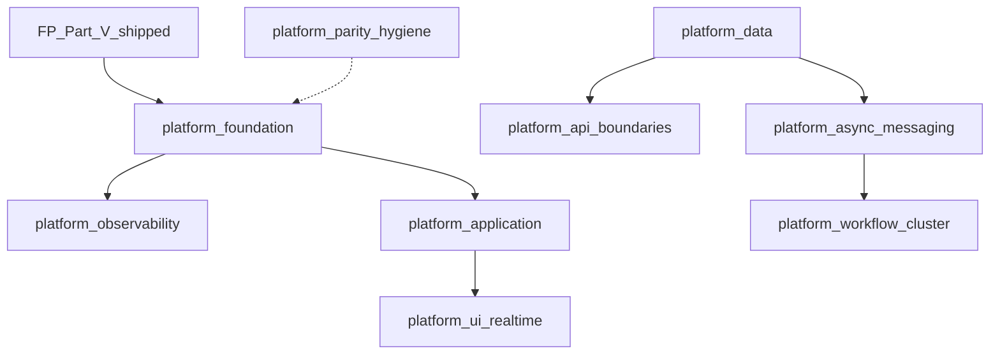

# Unified Application Platform Roadmap

Single index for **FP Kitchen Sink** (Part V) and **Platform Kitchen Sink** (Part VI–VII).

## Part V — Functional patterns (shipped)

See [fp-patterns/ROADMAP.md](../fp-patterns/ROADMAP.md).

| Plan | Mission ID | Spec | Book |
|------|------------|------|------|
| [fp_algebra_foundation](../../.cursor/plans/fp_algebra_foundation.plan.md) | `pln-mqjykorq-bvmr7a` | fp-algebra | Part V ch17 |
| [fp_optics_immutable](../../.cursor/plans/fp_optics_immutable.plan.md) | `pln-mqjykos6-ovw199` | fp-optics | Part V ch18 |
| [fp_state_process](../../.cursor/plans/fp_state_process.plan.md) | `pln-mqjykov9-bcblcg` | fp-fsm | Part V ch19 |
| [fp_parse_codec](../../.cursor/plans/fp_parse_codec.plan.md) | `pln-mqjykox8-rmjgqz` | fp-parse | Part V ch20 |
| [fp_runtime_resilience](../../.cursor/plans/fp_runtime_resilience.plan.md) | `pln-mqjykp1v-cdoxhr` | fp-runtime | Part V ch21 |
| [fp_streaming_advanced](../../.cursor/plans/fp_streaming_advanced.plan.md) | `pln-mqjykp6a-uo9tbq` | fp-streaming | Part V ch22 |
| [fp_events_graph](../../.cursor/plans/fp_events_graph.plan.md) | `pln-mqjykpbf-qbf6qg` | fp-events | Part V ch23 |
| [fp_dx_metaprogramming](../../.cursor/plans/fp_dx_metaprogramming.plan.md) | `pln-mqjykpfk-a28tq5` | fp-dx | Part V ch24 |

FP meta: `pln-mqjykoig-a58dfk`

## Part VI–VII — Application platform

| Plan | Mission ID | Spec | Book |
|------|------------|------|------|
| [platform_foundation](../../.cursor/plans/platform_foundation.plan.md) | `pln-mqk3uzlz-ffz1p1` | platform-foundation | Part VI ch26 |
| [platform_observability](../../.cursor/plans/platform_observability.plan.md) | `pln-mqk3v1k9-6c8qcj` | platform-observability | Part VI ch27 |
| [platform_data](../../.cursor/plans/platform_data.plan.md) | `pln-mqk3uxtf-055tfk` | platform-data | Part VI ch28 |
| [platform_api_boundaries](../../.cursor/plans/platform_api_boundaries.plan.md) | `pln-mqk3uv7g-4r9v0a` | platform-api-boundaries | Part VI ch29 |
| [platform_application](../../.cursor/plans/platform_application.plan.md) | `pln-mqk3uw14-l2rehg` | platform-application | Part VI ch30 |
| [platform_async_messaging](../../.cursor/plans/platform_async_messaging.plan.md) | `pln-mqk3ux00-wrxxug` | platform-async-messaging | Part VI ch31 |
| [platform_workflow_cluster](../../.cursor/plans/platform_workflow_cluster.plan.md) | `pln-mqk3v34c-c8b55j` | platform-workflow-cluster | Part VI ch32 |
| [platform_ui_realtime](../../.cursor/plans/platform_ui_realtime.plan.md) | `pln-mqk3v2du-i1jila` | platform-ui-realtime | Part VII ch33 |
| [platform_dx_ship](../../.cursor/plans/platform_dx_ship.plan.md) | `pln-mqk3uymr-cb8ftt` | platform-dx-ship | Part VI ch34 |
| [platform_ai](../../.cursor/plans/platform_ai.plan.md) | `pln-mqk3uu83-9z30eo` | platform-ai | Part VI ch35 |
| [platform_parity_hygiene](../../.cursor/plans/platform_parity_hygiene.plan.md) | `pln-mqk3tuel-6cy7au` | platform-parity-hygiene | — |

Platform meta: `pln-mqk3v0l4-66d3zl`

## Execution order (platform)

1. `platform_parity_hygiene` (continuous) + `platform_foundation`
2. `platform_observability` ∥ `platform_data`
3. `platform_api_boundaries`
4. `platform_application`
5. `platform_async_messaging`
6. `platform_workflow_cluster`
7. `platform_ui_realtime`
8. `platform_dx_ship` ∥ UI once application host ready
9. `platform_ai`

## Dependency graph

## Effect.ts parity phases

See [effect-ts-parity/README.md](../effect-ts-parity/README.md).
